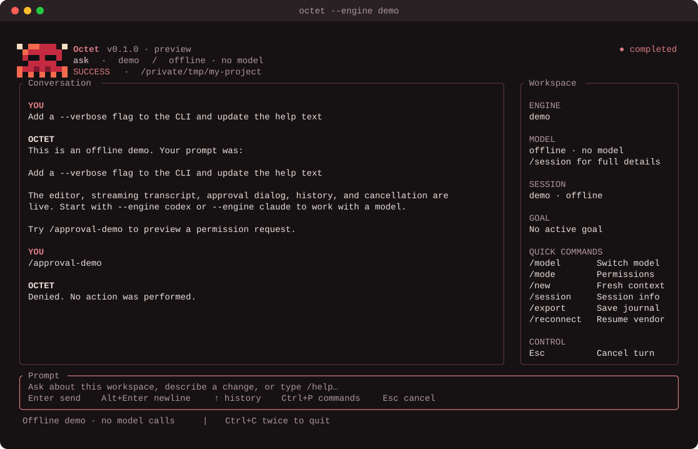

<p align="center">
  
</p>

<h1 align="center">Octet</h1>

<p align="center">
  A native terminal workspace for the official <b>Claude Code</b> and <b>Codex</b> CLIs.
</p>

<p align="center">
  <a href="#license"></a>
  
  
</p>

Octet runs the vendor's own `claude` or `codex` binary, streams its replies
into one terminal screen, puts every permission request in front of you, and
keeps a private journal of each session. It never touches the vendors'
credentials: each CLI uses its own login.

It is a single Rust binary for macOS and Linux, with no browser, server or
Python runtime. You can switch models and providers mid-session, leave a goal
running across turns, and pick the session up from your phone.

<p align="center">
  
</p>

## Features

**Conversations**

- Multi-turn sessions with Claude Code or Codex. Replies stream in alongside
  tool activity, usage and errors.
- An offline `demo` engine to try the interface without any login. When a
  `!` attachment or a goal changes what a model would receive, the demo's
  reply shows that text too.
- `/new` starts fresh context; `/reconnect` and `--resume ID` reopen a vendor
  session. `/sessions` lists this workspace's recent sessions and `/resume N`
  reopens one, with either vendor.
- While a turn runs, Enter queues the next prompt (up to 8); `/steer` adds to
  the running Codex turn.
- `/fork` continues the conversation in a new vendor session, `/compact` asks
  the vendor to compact its context, and `--effort` or `/effort` sets the
  reasoning effort.
- `/image PATH` attaches PNG, JPEG, GIF or WebP images to the next prompt.
- `/sessions`, `/export` and `/remote-control` run in the background, so
  replies and approvals keep flowing while they work; a job carries on
  across a reconnect.

**Scripts and other programs**

- `octet --print "PROMPT"` runs one turn and writes the reply; `--output
  json` writes every event as a JSON line. `octet --rpc` takes JSON-line
  commands on stdin. Neither needs a terminal, and approvals fail closed.
- Tagged versions publish prebuilt archives for macOS (Apple silicon) and
  Linux (x86-64 and ARM64).

**Models and providers**

- `/model` lists the models your installed CLI advertises, with names, full
  IDs and descriptions. Octet keeps no hard-coded catalogue.
- Change model within a provider (the vendor session continues), or switch
  provider mid-session with `/model claude` or `/model codex`. The transcript
  stays on screen, and your next prompt carries it to the new provider (at
  most 64 KiB, newest turns first).

**Permissions and approvals**

- Four permission modes, mapped onto each vendor's own settings: `ask`,
  `accept-edits`, `auto` (the vendor's reviewer decides) and `full-access`.
  Shift+Tab cycles the first three live; `full-access` has to be typed.
- The approval dialog shows the whole request: allow once or deny. Expired,
  cancelled, oversized and unknown requests are denied, and so is any
  request beyond eight waiting at once. Claude is told why.
- One reply shows at most 2 MiB, with a note where it is cut.
- Octet rings the bell and sends a desktop notification when an approval
  starts waiting. `--approval-timeout` sets how long it waits (10–3600
  seconds, default 120).

**Goals**

- `/goal <objective>` keeps the agent working turn after turn until it reports
  the goal complete with evidence. Pause, resume, request an audit or clear
  it. A goal survives a restart and comes back paused.

**Journals**

- Every event is written to a private (mode 0600), append-only JSONL journal
  before it reaches the screen. `/session` shows the path; `/export` copies it
  without overwriting anything.

**From your phone**

- Run Octet in tmux on your Mac and reach it from an iPhone over Tailscale and
  mosh. `/remote-control` checks the Mac's side without changing anything and
  prints the exact command for Blink or Termius.
  [Step-by-step guide](docs/remote-control.md).

**In the terminal**

- A multiline editor with Unicode-aware editing, bracketed paste and history.
  `@` suggests workspace files, Tab completes paths and commands, Ctrl+G
  opens the prompt in your own editor, and the prompt box grows with the
  draft.
- `!git status` runs a command and attaches its output to your next prompt;
  `!!` runs it without attaching. `/copy` (Ctrl+X) puts the last reply on
  the clipboard, even over SSH to a phone.
- Works down to 38×12 cells; a workspace panel appears from 112 columns.
  Respects `NO_COLOR`.
- Ctrl+Z suspends to the shell. The terminal is restored on exit, on signals
  and on panic.
- Octet the octopus changes pose with what the agent is doing: thinking,
  coding, searching, delegating, waiting for approval and more.

## Status

Octet is a working preview (v0.1.0). On 2026-10-07 the release binary was
checked end to end against Claude Code 2.1.289 and Codex CLI 0.154: streaming,
tool approvals (allow and deny), interrupts, all four permission modes, model
and provider switching, resume, fork, compaction, reasoning effort, images,
steering, the session browser, `!` and `@`, goals, export, print/JSON/RPC
modes and clean shutdown.

Not yet supported: multi-agent (fleet) orchestration and quota routing, the
vendors' plugin, hook and resource surfaces, Octet-owned history with
branching and labels, and the Python era's RPC envelope. The
[parity matrix](docs/rust/parity-matrix.md) says why each waits.

## Requirements

- macOS or Linux.
- Rust 1.98.1, pinned in `rust-toolchain.toml` (rustup installs it on first
  build), and a C linker.
- For real sessions, `claude` and/or `codex` on your `PATH`, already logged
  in. The demo needs neither.

## Install

```sh
git clone https://github.com/cartmancodes/octet.git
cd octet
make rust-build
./target/release/octet --engine demo
```

To install it for your user, in `~/.local/bin`:

```sh
cargo install --locked --path crates/octet --root "$HOME/.local"
```

## Quick start

```sh
octet --engine demo                              # offline preview
octet --engine claude --cwd /path/to/project     # Claude Code
octet --engine codex --cwd /path/to/project      # Codex (the default engine)
```

| Option | Meaning |
| --- | --- |
| `--engine codex\|claude\|demo` | Which CLI to drive (default `codex`) |
| `--cwd PATH` | Workspace directory (default: the current one) |
| `--model MODEL` | Model to open the session with |
| `--mode MODE` | `ask` (default), `accept-edits`, `auto` or `full-access` |
| `--resume ID` | Reopen a vendor session |
| `--binary PATH` | Use a specific CLI binary |
| `--journal-dir PATH` | Where journals go (default `~/.local/share/octet/rust-preview`) |
| `--approval-timeout SECONDS` | How long an approval waits before it is denied (10–3600) |
| `--effort LEVEL` | Reasoning effort (`low`, `medium`, `high`, `xhigh`, `max` for Claude; Codex decides per model) |
| `--print PROMPT`, `-p PROMPT` | Run one turn without the interface and write the reply; `-` reads the prompt from stdin; `--print=TEXT` also works |
| `--output text\|json` | With `--print`: the reply text (default), or every event as a JSON line |
| `--rpc` | Take JSON-line commands on stdin and write events as JSON lines |

**Keys**

| Key | Action |
| --- | --- |
| Enter | Send the prompt |
| Alt+Enter, Ctrl+J | New line |
| Esc | Cancel the running turn (and drop queued prompts) |
| Up / Down | Prompt history |
| Shift+Tab | Cycle permission mode: ask → accept-edits → auto |
| A / D | Allow once / deny a permission request (from 0.4 s after it opens) |
| PageUp / PageDown | Scroll the conversation |
| Ctrl+P | Command palette (also offers Ctrl+G, `@` and `!`) |
| @ | Mention a file |
| Tab | Complete a path or command |
| Ctrl+G | Edit the prompt in $EDITOR |
| Ctrl+X | Copy the last reply |
| F1 | Help |
| Ctrl+Z | Suspend to the shell |
| Ctrl+C twice | Quit |

**Commands**

| Command | Action |
| --- | --- |
| `/model [PROVIDER] [MODEL]` | Show the catalogue, or switch model or provider |
| `/mode [MODE]` | Show or change the permission mode |
| `/goal [OBJECTIVE \| status \| pause \| resume \| complete \| clear]` | Run a multi-turn goal |
| `/session` | Session ID, model details and journal path |
| `/new` | Start fresh vendor context |
| `/reconnect` | Reopen the current vendor session |
| `/export [PATH]` | Copy the journal to a new file |
| `/copy` | Copy the last reply to the clipboard |
| `/queue [clear]` | Show or clear prompts queued during a turn |
| `/steer TEXT` | Add to the running turn (Codex); queued as the next prompt for Claude |
| `/effort [LEVEL \| default]` | Show or set the reasoning effort |
| `/fork` | Continue this conversation in a new vendor session |
| `/compact` | Ask the vendor to compact its context |
| `/image PATH` | Attach an image to the next prompt |
| `/sessions`, `/resume N` | List this workspace's recent sessions; reopen one |
| `!cmd`, `!!cmd` | Run a shell command; `!` attaches its output to the next prompt |
| `/remote-control` | Check phone access |
| `/help`, `/quit` (`/exit`) | Help; save and exit |

The full reference, including how each permission mode maps onto each vendor
and every limit, is in [docs/tui.md](docs/tui.md).

## Documentation

Start at the [documentation index](docs/README.md). The main guides:

- [Using the terminal UI](docs/tui.md): keys, commands, modes, models,
  journals and limits
- [Use Octet from your phone](docs/remote-control.md)
- [Persistent goals](docs/rust/goals.md)

## Project layout

| Crate | Role |
| --- | --- |
| `crates/octet` | The `octet` binary, with its terminal and credential-guard tests |
| `crates/octet-tui` | The terminal interface |
| `crates/octet-core` | Session boundary, model selection and persistent goals |
| `crates/octet-engine` | The provider table and vendor drivers ([adding a provider](docs/rust/adding-a-provider.md)) |
| `crates/octet-gate` | The protocol gate that records live contract evidence from real vendor CLIs |
| `crates/octet-proc` | Bounded JSON-line transport and process supervision for vendor CLIs |
| `crates/octet-store` | Append-only session journals |
| `crates/octet-testkit` | Scripted fake vendors for tests |

## Contributing

Contributions are welcome. [CONTRIBUTING.md](CONTRIBUTING.md) covers building,
the `make rust-check` gate, and the rule that Octet never reads vendor
credentials. Changes are listed in [CHANGELOG.md](CHANGELOG.md).

## License

Licensed under either of

- Apache License, Version 2.0 ([LICENSE-APACHE](LICENSE-APACHE) or
  <https://www.apache.org/licenses/LICENSE-2.0>)
- MIT license ([LICENSE-MIT](LICENSE-MIT) or <https://opensource.org/licenses/MIT>)

at your option.

Unless you explicitly state otherwise, any contribution intentionally
submitted for inclusion in the work by you, as defined in the Apache-2.0
license, shall be dual licensed as above, without any additional terms or
conditions.

Octet is an independent project. It is not affiliated with or endorsed by
Anthropic or OpenAI. Claude Code is a product of Anthropic and Codex a
product of OpenAI; their names belong to their owners.
