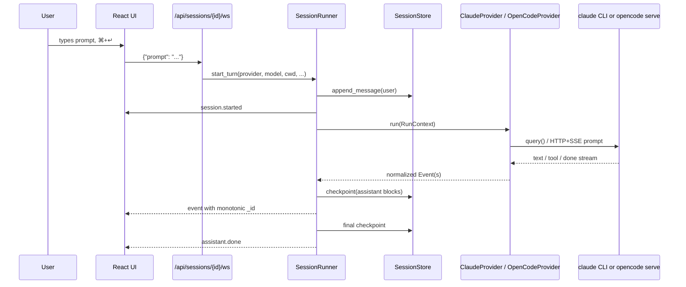
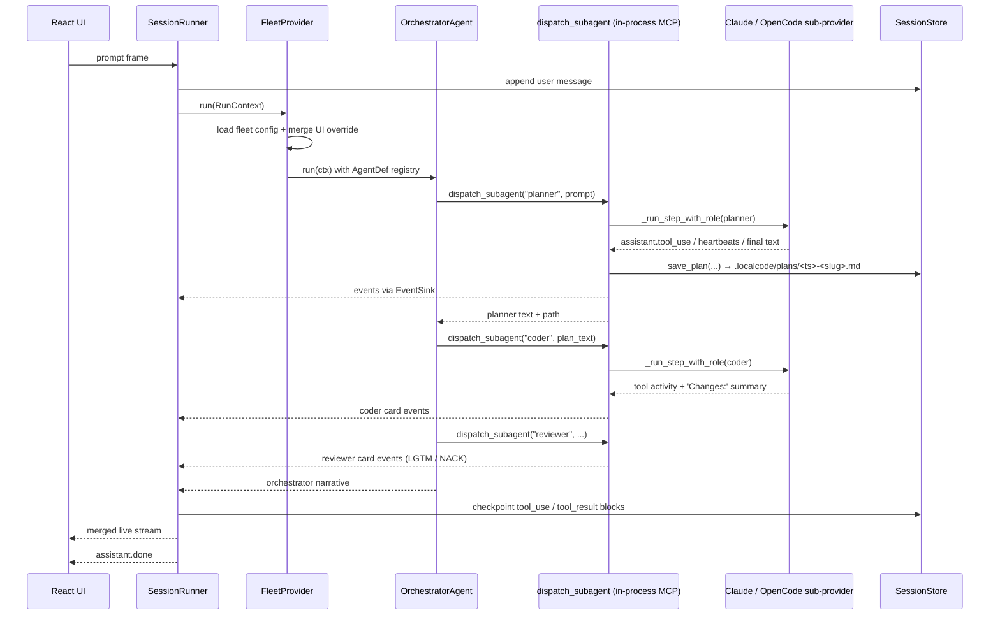
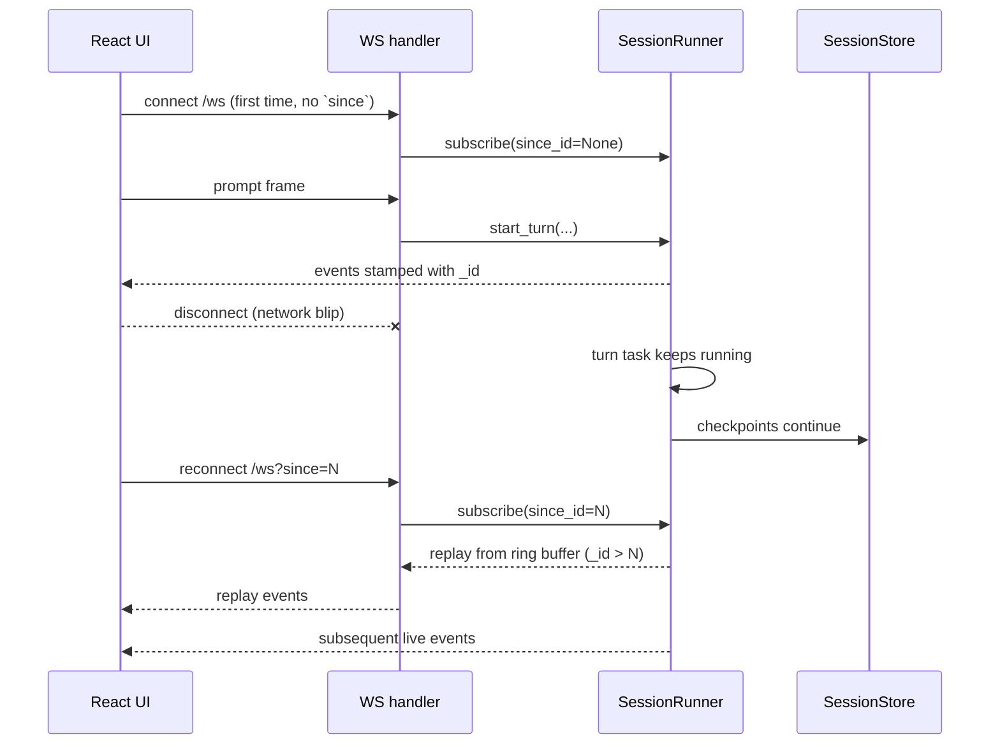
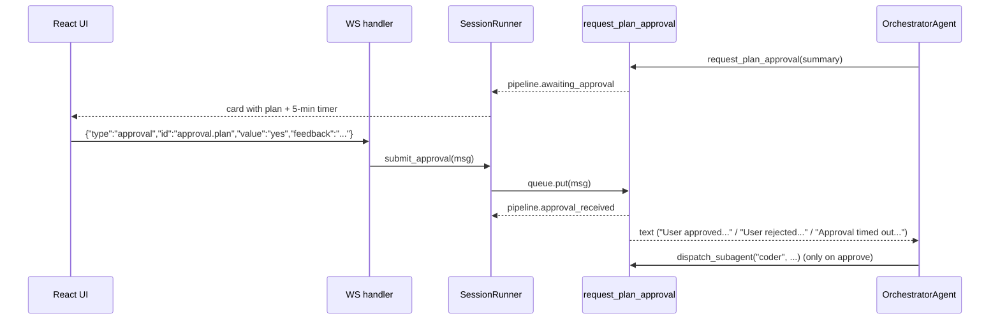

# Architecture

## Overview

LocalCode is a local, single-user coding-agent UI and orchestrator. One
Claude-Code-style web chat surface sits in front of three interchangeable
backends:

- **`claude`** — runs the official `claude` CLI through `claude-agent-sdk`.
- **`opencode`** — talks to a host-side `opencode serve` process over HTTP
  and SSE.
- **`fleet`** — runs an LLM-driven orchestrator that delegates work to
  specialist subagents (planner / developer / coder / reviewer / tester)
  through an in-process MCP server. Subagents can themselves be
  `claude`- or `opencode`-backed in the same workflow.

The application is deliberately host-side and single-user:

- OAuth credentials stay in each upstream tool's own auth store
  (`~/.claude/` or the platform keychain for Claude Code, and
  `~/.local/share/opencode/auth.json` for OpenCode). LocalCode never sees
  provider API keys.
- Sessions and planner artifacts are persisted as files on disk under
  `.localcode/`. There is **no application database**.
- A Vite/React UI connects to a FastAPI backend over REST + WebSocket.
  The backend normalizes every provider's stream into one event protocol
  and fans live events out to WebSocket subscribers.

The two architectural unlocks worth naming up front:

1. A `Provider` protocol turns "which agent answered" into an
   implementation detail. The fleet is *itself* a provider, so the UI
   has no special path for multi-agent workflows.
2. A custom `dispatch_subagent` MCP tool lets one orchestrator dispatch
   both Claude- and OpenCode-backed subagents in the same workflow —
   this is what lets you mix `claude-opus-4-7` for planning with
   `openai/gpt-5.3-codex` (through OpenCode) for the bulk of the coding.

## Tech Stack

### Backend (`pyproject.toml`)

- Python `>=3.11`.
- `fastapi >= 0.115.0`
- `uvicorn[standard] >= 0.32.0`
- `pydantic >= 2.9.0`, `pydantic-settings >= 2.6.0`
- `httpx >= 0.27.2` (OpenCode HTTP + SSE)
- `websockets >= 13.1`
- `claude-agent-sdk >= 0.0.10`
- `python-dotenv >= 1.0.1`
- `pyyaml >= 6.0.2` (fleet config loading)
- Dev: `pytest >= 8.3.0`, `pytest-asyncio >= 0.24.0`,
  `pytest-httpx >= 0.32.0`, `ruff >= 0.7.0`, `mypy >= 1.13.0`.
- Build: `hatchling`. Package wheel includes `backend/app`.
- Ruff lint selects `E, F, I, B, UP, N, ASYNC`; line length 100.
- `pytest` asyncio mode is `auto`; `testpaths = ["backend/tests"]`
  (no tests are shipped in the repo today).

### Frontend (`frontend/package.json`)

- `react ^18.3.1`, `react-dom ^18.3.1`
- `vite ^5.4.10`, `@vitejs/plugin-react ^4.3.3`
- `typescript ^5.6.3`
- Scripts: `dev` (`vite`), `build` (`tsc -b && vite build`),
  `preview` (`vite preview`).

### VS Code Extension (`vscode-extension/package.json`)

- Plain CommonJS extension — no build step.
- VS Code engine `^1.74.0`.

### Host-side CLIs (installed by `setup.sh`)

- `claude` CLI (`npm i -g @anthropic-ai/claude-code`).
- `opencode` CLI (`curl -fsSL https://opencode.ai/install | bash` →
  `~/.opencode/bin/opencode`).

## Repository Structure

```text
.
|-- README.md                       Project overview, setup entry point
|-- Makefile                        Developer shortcuts (some docker/db targets are stale)
|-- pyproject.toml                  Backend package + Python deps + ruff/pytest config
|-- setup.sh                        Host bootstrap: deps, .env, .venv, login, start/stop/status/logs
|-- .env.example                    Backend settings template
|-- .localcode/
|   |-- fleet.yaml                  Active project fleet config (planner+developer+coder+reviewer)
|   |-- fleet.yaml.example          Annotated YAML fleet-config starter
|   |-- fleet.json.example          JSON fleet-config starter
|   |-- plans/                      Planner-written Markdown implementation plans
|   `-- sessions/                   Session files for this project (uuid/meta.json + messages.jsonl)
|-- backend/
|   |-- __init__.py
|   `-- app/
|       |-- __init__.py
|       |-- main.py                 FastAPI app factory, lifespan, route registration
|       |-- config.py               Pydantic Settings, CatalogEntry, CORS/cwd allowlist
|       |-- schemas.py              REST + WebSocket Pydantic schemas
|       |-- session_runner.py       SessionRunner: per-session turn task, replay buffer, fan-out
|       |-- orchestrator/
|       |   |-- __init__.py         Re-exports get_provider
|       |   |-- base.py             Provider protocol, RunContext, Event, EventType
|       |   |-- agent_def.py        AgentDef + registry_from_role_library + render_registry_for_prompt
|       |   |-- registry.py         Lazy provider singleton registry (warm_up / shutdown_all)
|       |   |-- claude.py           ClaudeProvider — wraps claude-agent-sdk.query()
|       |   |-- opencode.py         OpenCodeProvider — HTTP + SSE against opencode serve
|       |   |-- fleet/              FleetProvider package (split by concern — see below)
|       |   |   |-- __init__.py     Public-API facade (re-exports the names below)
|       |   |   |-- constants.py    VALID_ROLES/PROVIDERS, timeouts, StepTimeoutError
|       |   |   |-- models.py       RoleConfig, FleetConfig, Step dataclasses
|       |   |   |-- prompts.py      Per-role system prompts (PLANNER_SYSTEM, …)
|       |   |   |-- presets.py      WORKFLOW_PRESETS
|       |   |   |-- defaults.py     ROLE_LIBRARY, DEFAULT_FLEET_CONFIG
|       |   |   |-- loader.py       Locate/parse/merge/cache/serialize config
|       |   |   |-- gate.py         Reviewer/tester classifier (classify_gate)
|       |   |   |-- collect.py      Sub-provider stream → reviewable text + digest
|       |   |   `-- provider.py     FleetProvider + _run_step_with_role
|       |   |-- orchestrator.py     OrchestratorAgent — claude-agent-sdk session + merged event stream
|       |   `-- dispatch.py         In-process MCP server: dispatch_subagent + request_plan_approval
|       |-- routes/
|       |   |-- __init__.py
|       |   |-- sessions.py         REST + WebSocket for sessions
|       |   |-- models.py           GET /api/models
|       |   |-- fleet.py            GET /api/fleet/config
|       |   `-- system.py           GET /api/system/cwd
|       `-- storage/
|           |-- __init__.py
|           `-- sessions.py         SessionStore — filesystem CRUD + cleanup + compaction
|-- frontend/
|   |-- package.json                Frontend deps + scripts
|   |-- vite.config.ts              Vite config, /api → backend proxy with ws: true
|   |-- tsconfig.json / tsconfig.node.json
|   |-- index.html                  HTML shell + Google Fonts (Inter, JetBrains Mono)
|   `-- src/
|       |-- main.tsx                React entrypoint (StrictMode + createRoot)
|       |-- App.tsx                 Global state: theme/accent, sessions, models, cwd, additional_dirs
|       |-- api.ts                  REST client + openSessionSocket()
|       |-- types.ts                Shared TS types (StreamEvent, FleetConfig, etc.)
|       |-- styles.css              All UI styles
|       `-- components/
|           |-- ChatPane.tsx        Chat surface, WS lifecycle, replay, approval gate UI
|           |-- Composer.tsx        Prompt input (⌘+↵ to send)
|           |-- CrewBar.tsx         Fleet roles bar with status badges
|           |-- ErrorBoundary.tsx   React error boundary
|           |-- FleetConfigEditor.tsx Modal that emits per-session fleet override
|           |-- ProjectPicker.tsx   cwd + additional_dirs editor in the topbar
|           |-- Sidebar.tsx         Session list + model picker
|           |-- Topbar.tsx          Header (session info, theme toggle, project picker)
|           `-- icons.tsx           Inline SVG icon components
|-- vscode-extension/
|   |-- package.json                Extension contribution manifest
|   |-- extension.js                Webview sidebar/panel embedding the LocalCode UI
|   |-- README.md
|   `-- media/icon.svg              Activity-bar icon
|-- docs/
|   |-- architecture.md             (this file)
|   |-- fleet.md                    Fleet concept, roles, UX
|   |-- fleet-config.md             Configuration UX, presets, recipes
|   |-- storage.md                  Filesystem session store
|   `-- vscode-integration.md       VS Code extension docs
|-- stable_json/stable_json.py      Deterministic compact JSON helper
`-- opencode/
    |-- opencode.json               Minimal config used when setup.sh starts `opencode serve`
    |-- multiply.py                 Small standalone sample CLI
    `-- MEMORY_OPTIMISATIONS.md     Review notes for the sample CLI
```

No `Dockerfile`, no `docker-compose.yml`, no `.github/workflows/` are
present in the tree. The `Makefile` includes `up`/`down`/`logs`/`db-init`
targets that reference Docker Compose and `backend.app.db_init`, but
neither the compose file nor `db_init.py` exists today — those targets
are stale.

## Core Concepts

**Provider.** A protocol declared in `backend/app/orchestrator/base.py`.
Every backend exposes `open_session(ctx)`, `run(ctx)` (async iterator of
`Event`), and `aclose()`. Implementations: `ClaudeProvider`,
`OpenCodeProvider`, `FleetProvider`.

**`RunContext`.** Dataclass carrying everything a provider needs for one
turn: `model`, `prompt`, `cwd`, `additional_dirs`, `upstream_session_id`,
optional `system_prompt`, `extras` (used by the fleet for per-session
config overrides), and `approval_channel` (the HITL back-channel — an
`asyncio.Queue` of approval messages).

**`Event`.** Unified streaming event yielded by every provider. Types are:
`session.started`, `assistant.text`, `assistant.tool_use`, `tool.result`,
`assistant.done`, `error`, `pipeline.awaiting_approval`,
`pipeline.approval_received`.

**Session.** A chat pinned to one provider + model + cwd. Persisted on
disk as `meta.json` + append-only `messages.jsonl`. No database.

**`SessionRunner`.** One per active session. Owns turn execution
independently of any WebSocket connection: a turn keeps running across
client disconnects, and reconnects subscribe to a bounded replay buffer.

**`AgentDef`.** The orchestrator registry entry — `name`, `description`,
`provider`, `model`, `system_prompt`, optional `permission_mode`,
optional `max_turns`. Modelled after Claude Code's `AgentDefinition`.

**Fleet.** A workflow defined by which agents it contains. The fleet
provider loads a `FleetConfig`, builds an agent registry from its
`roles`, and runs the `OrchestratorAgent`. There is no separate
"pipeline" mode — orchestrator-as-agent is the single path.

**MCP dispatch.** `dispatch.py` builds a fresh in-process MCP server per
turn exposing two tools: `dispatch_subagent(name, prompt)` and
`request_plan_approval(plan_summary)`. The orchestrator's allowed-tool
list contains *only* these two — built-in Claude Code tools (Read, Edit,
Bash, Skill, Agent, Task, etc.) are explicitly denied so the
orchestrator can't bypass the registry.

**Plan.** When `dispatch_subagent` is invoked with the `planner` agent,
its Markdown output is written to `<cwd>/.localcode/plans/<timestamp>-<slug>.md`
by `save_plan()` in `dispatch.py`.

## Module Responsibilities

### Backend (`backend/`)

#### `backend/app/main.py`
- `create_app()` builds the FastAPI app from `Settings.app_name`,
  installs CORS from `Settings.cors_origin_list`, registers four
  routers (`sessions`, `models`, `fleet`, `system`) and a single inline
  `/api/health` route returning `{"status": "ok", "env": s.env}`.
- The lifespan context calls `warm_up()` to construct provider
  singletons up front and `session_store.cleanup_expired(...)` to sweep
  stale sessions on startup (no-op when the 24-hour sentinel is fresh).
  Shutdown calls `shutdown_all()`.

#### `backend/app/config.py`
- `Settings` (pydantic-settings, env file `.env`, `extra="ignore"`)
  with fields enumerated under [Configuration](#configuration).
- `CatalogEntry` parses `MODEL_CATALOG` into `(provider, model)` pairs.
  Malformed entries are silently skipped to avoid boot failures.
- `Settings.cwd_allowlist()` returns resolved `Path`s; empty allowlist
  = permissive.
- `get_settings()` is `@lru_cache(maxsize=1)`-decorated.

#### `backend/app/schemas.py`
- Request/response models: `CreateSessionRequest`, `SessionOut`,
  `MessageOut` (with a `Decimal → float` validator for legacy data),
  `MessagesPage`, `CatalogModel`, and the unified WebSocket
  `StreamEvent`.

#### `backend/app/session_runner.py`
- `SessionRunner` decouples turn execution from any WebSocket
  connection. State lives on the runner, not on the WS handler.
- Constants: `_REPLAY_BUFFER_SIZE = 256`, `_SUBSCRIBER_QUEUE_MAX = 512`.
- Public API: `subscribe(since_id)` → `(queue, replay_list)`,
  `unsubscribe(queue)`, `submit_approval(msg)`, `start_turn(...)` (rejects
  a second turn while one is running), `cancel_turn()`.
- `_execute_turn`:
  - Persists the user message first so a failure later still leaves a
    visible prompt in history.
  - Builds a `RunContext` with the runner's per-turn `approval_q`.
  - Drains `provider.run(ctx)`:
    - `assistant.text` (non-heartbeat) accumulates into a text buffer.
    - `assistant.tool_use` flushes any buffered text, appends a
      `tool_use` block, and checkpoints.
    - `tool.result` appends a `tool_result` block and checkpoints.
    - `assistant.done` captures `cost_usd` and `duration_ms`.
  - Heartbeat text (`heartbeat: True`) is broadcast live but **never
    persisted** — UI chrome only.
  - On `asyncio.CancelledError` (shutdown / delete) emits an `error`
    event and re-raises; on other exceptions logs and emits `error`.
  - The `finally` block synthesizes `tool_result` blocks for any
    `tool_use` that never got one (cancellation mid-turn) and always
    emits an `assistant.done` even on error so the UI clears its
    spinner.
- `_broadcast()` stamps each event with a monotonic `_id`, appends to
  the replay ring, and `put_nowait`s into every subscriber queue. Full
  queues are skipped (a slow viewer can't pin the producer).
- Module-level `get_runner(session_id)` is lazy + lock-guarded;
  `drop_runner(session_id)` and `drop_all_runners()` cancel turns and
  forget runners.

#### `backend/app/orchestrator/base.py`
- `EventType` literal, `Event` dataclass, `RunContext` dataclass,
  `Provider` protocol (see [Core Concepts](#core-concepts)).

#### `backend/app/orchestrator/registry.py`
- Lazily builds and caches singleton providers (`claude`, `opencode`,
  `fleet`). Lock is created lazily so it binds to the running event
  loop (avoids cross-loop latching in tests).
- `warm_up()` constructs all three at startup; `shutdown_all()` calls
  `aclose()` on each.

#### `backend/app/orchestrator/claude.py`
- `ClaudeProvider`. `open_session()` is a no-op (claude-agent-sdk's
  `query()` is stateless per call).
- `run()` builds `ClaudeAgentOptions(model=ctx.model, cwd=ctx.cwd,
  add_dirs=ctx.additional_dirs, system_prompt=ctx.system_prompt,
  permission_mode="acceptEdits", include_partial_messages=True)` and
  drives `query()` until the iterator drains.
- `_translate()` maps SDK messages to events: `StreamEvent` →
  `assistant.text` (only `text_delta` deltas); `AssistantMessage` →
  `assistant.tool_use` / `tool.result` (skips `TextBlock` to avoid
  doubling the deltas); `UserMessage` → `tool.result`; `ResultMessage`
  → `assistant.done` with `cost_usd`, `duration_ms`, `num_turns`;
  `SystemMessage` → ignored.

#### `backend/app/orchestrator/opencode.py`
- `OpenCodeProvider` uses one `httpx.AsyncClient` against
  `OPENCODE_BASE_URL` (default `http://localhost:4096`) with a 60s
  connect timeout, `read=None` (SSE is open-ended), and
  `Limits(max_connections=5, max_keepalive_connections=2)`.
- `open_session()` POSTs to `/session?directory=<cwd>` and returns
  `{"id": ...}`. `directory` is a *query* param, not a body field
  (OpenCode silently drops unknown body keys).
- `run()`:
  - Splits `ctx.model` on `/` into `providerID` / `modelID` and emits a
    clear error event if the slash is missing (no silent "openai"
    default).
  - Opens the SSE stream `GET /global/event` *before* firing the
    prompt so it doesn't miss early events.
  - POSTs `/session/{id}/prompt_async?directory=<cwd>` with body
    `{"model": {providerID, modelID}, "parts": [{type: "text", text}]}`
    (and `system` when set).
  - Drains `data:` lines, unwraps the
    `{directory, project, payload}` envelope, drops `payload.type ==
    "sync"` duplicates, and translates inner events.
- `_translate()` correlates `message.updated` (records user message ids
  to skip echoes; emits `assistant.done` on assistant completion) and
  `message.part.updated`/`message.part.added` (text deltas via
  per-part length-seen tracking; tool parts → `assistant.tool_use` on
  `running`/`pending`, `tool.result` on `completed`/`error`).
- `ctx.additional_dirs` is intentionally **not forwarded** — OpenCode
  binds each session to a single project; multi-dir grants only affect
  Claude-provider roles.

#### `backend/app/orchestrator/fleet/`

Originally one ~1k-line `fleet.py`; split into a package by concern. The
import surface is unchanged — `fleet/__init__.py` is a facade that
re-exports every previously-importable name (including back-compat
aliases `_classify_gate`, `_collect_text`, `_merge_config`), so external
importers (`routes/fleet.py`, `registry.py`, `dispatch.py`) are
untouched. Dependency flow is one-way:
`constants → models → defaults → loader/provider`; the cross-package
imports (`registry`, `agent_def`, `orchestrator`) stay lazy to avoid
cycles. Submodules: `constants`, `models`, `prompts`, `presets`,
`defaults`, `loader`, `gate`, `collect`, `provider`.

- Constants (`fleet/constants.py`):
  - `VALID_PROVIDERS = ("claude", "opencode")`
  - `VALID_ROLES = ("planner", "developer", "coder", "reviewer", "tester")`
  - `WORKER_ROLES = ("developer", "coder", "reviewer", "tester")`
  - `HEARTBEAT_INTERVAL_S = 30.0`, `STEP_TIMEOUT_S = 600.0`
- `WORKFLOW_PRESETS`: 10 named presets the UI exposes as one-click
  starters (`full`, `plan-code-review-test`, `plan-code-test`,
  `plan-and-code`, `design-and-code`, `design-only`, `code-and-review`,
  `code-only`, `plan-only`, `review-only`).
- `RoleConfig(provider, model, system_prompt)` and `FleetConfig`
  (`name`, `roles`, `entry_role`, `max_steps=6`,
  `max_review_retries=1`, `require_plan_approval=False`,
  `config_source`).
- `ROLE_LIBRARY` (`fleet/defaults.py`) — built-in default `RoleConfig`
  per role with carefully scoped system prompts from `fleet/prompts.py`
  (`PLANNER_SYSTEM`, etc.).
- `DEFAULT_FLEET_CONFIG` (`fleet/defaults.py`) — `planner + coder +
  reviewer + tester`, `entry_role="coder"`.
- `WORKFLOW_PRESETS` lives in `fleet/presets.py`; `RoleConfig` /
  `FleetConfig` / `Step` in `fleet/models.py`.
- `load_fleet_config(cwd)` (`fleet/loader.py`) walks the candidate list (see
  [Configuration](#configuration)), parses YAML/JSON, merges through
  `_merge_config`, and caches by `(path, mtime)` in a 16-entry FIFO
  cache. Invalid fields are dropped with a warning rather than failing.
- `_merge_config` (`fleet/loader.py`) semantics: when `override["roles"]` is supplied it
  *replaces* workflow membership; otherwise base membership survives
  and per-field overrides merge.
- `FleetProvider` (`fleet/provider.py`). `run()` loads file config, merges any per-session UI
  override (`ctx.extras["fleet_config_override"]`), and dispatches to
  `_run_orchestrated()` which builds an `AgentDef` registry via
  `registry_from_role_library(cfg.roles)`, instantiates
  `OrchestratorAgent`, and yields the merged stream. Always ends with
  `assistant.done` carrying `duration_ms`.
- `_run_step_with_role(step, role_cfg, ctx, outputs)` is the per-role
  executor that the MCP `dispatch_subagent` tool delegates to:
  - Emits a visible `assistant.tool_use` (name
    `"<role> [<provider>:<model>]"`, input `{prompt: <≤600 chars>}`).
  - Concurrently runs `_collect_text` and a heartbeat ticker. Every
    `HEARTBEAT_INTERVAL_S` it yields an `assistant.text` heartbeat
    (`"_…<role> still working (Ns)…_\n"`) until `STEP_TIMEOUT_S` is
    hit — that raises `StepTimeoutError` after emitting a
    `tool.result is_error=True`.
  - Classifies reviewer/tester gates via `_classify_gate` and marks
    the `tool.result` as `is_error=True` for non-LGTM outcomes.
- `collect_text()` (`fleet/collect.py`, aliased `_collect_text`) calls
  the sub-provider and concatenates assistant text. When tools fired, it
  appends a `\n---\n(tool activity from <provider>:<model>)\n…` digest so
  reviewers/testers can verify what the worker actually did rather than
  trusting its narrative.
- `classify_gate(output, role)` (`fleet/gate.py`, aliased
  `_classify_gate`) strips the tool digest, walks the
  body backwards for the last classifier-shaped line, tolerates
  Markdown decoration, and returns `"lgtm"`, `"nack"`, `"nack_code"`,
  or `"nack_tests"`. Fail-safe: unclassified reviewer output is
  `"nack"`; unclassified tester output is `"nack_code"`.

#### `backend/app/orchestrator/agent_def.py`
- `AgentDef` dataclass — `name`, `description`, `provider`, `model`,
  `system_prompt`, optional `permission_mode`, optional `max_turns`,
  free-form `metadata`.
- `registry_from_role_library(role_library)` converts the legacy
  `RoleConfig` dict into an `AgentDef` registry, baking in canonical
  descriptions for each role.
- `render_registry_for_prompt(registry)` renders the registry as a
  Markdown bullet list for the orchestrator's system prompt
  (`- \`name\` (provider:model) — description`).

#### `backend/app/orchestrator/orchestrator.py`
- `DEFAULT_ORCHESTRATOR_MODEL = "claude-sonnet-4-6"`,
  `DEFAULT_ORCHESTRATOR_MAX_TURNS = 30`.
- `ORCHESTRATOR_SYSTEM` is the system prompt; `HITL_BLOCK` is injected
  between planner and coder dispatch steps when
  `require_plan_approval` is true.
- `OrchestratorAgent.run(ctx)`:
  - Builds a fresh MCP server via `build_dispatch_mcp(...)`.
  - Wires `ClaudeAgentOptions` with `mcp_servers={"fleet_dispatch":
    mcp_server}`, `allowed_tools` containing **only** the two MCP tool
    names, `setting_sources=[]` (so user/project Claude Code settings
    can't re-grant built-in tools), and an explicit `disallowed_tools`
    list covering `Read, Edit, Write, MultiEdit, Bash, BashOutput,
    KillBash, Glob, Grep, WebFetch, WebSearch, Skill, Agent, Task,
    TodoWrite, ExitPlanMode, EnterPlanMode, NotebookEdit, ToolSearch`.
  - `permission_mode="default"`, `max_turns=self.max_turns`,
    `include_partial_messages=True`.
  - Two concurrent producers feed a single merged `asyncio.Queue`:
    `_pump_orchestrator()` drains the SDK iterator through
    `_translate_orchestrator_message` (suppresses the
    `dispatch_subagent` / `request_plan_approval` tool_use cards —
    those bodies emit their own per-role events); `_pump_sink()`
    drains the `EventSink` populated by the dispatch tool bodies.
  - A third task seals the queue when both producers finish; the
    consumer cancels everything on early exit.

#### `backend/app/orchestrator/dispatch.py`
- `APPROVAL_TIMEOUT_S = 300.0`.
- `EventSink` — bounded (256) `asyncio.Queue` with sentinel-based
  `close()`.
- `build_dispatch_mcp(registry, ctx, sink, run_step_fn)` returns
  `(mcp_server, allowed_tool_names)` where the tool names are
  `mcp__fleet_dispatch__dispatch_subagent` and
  `mcp__fleet_dispatch__request_plan_approval`. A fresh server is
  built per turn so closures capture this turn's `registry/ctx/sink`.
- `dispatch_subagent(name, prompt)`:
  - Validates `name` against the registry; returns an `is_error` text
    payload otherwise.
  - Builds a `RoleConfig` from the `AgentDef`, a `Step` with an id
    like `orch.<agent>.<n>`, runs `run_step_fn(step, role_cfg, ctx,
    outputs)`, and pushes every yielded event onto the sink.
  - Returns the subagent's final text. When `agent.name == "planner"`,
    `save_plan(result, ctx.cwd)` writes
    `<cwd>/.localcode/plans/YYYYMMDD-HHMMSS-<slug>.md` and the path is
    appended to the returned text.
- `request_plan_approval(plan_summary)`:
  - If `ctx.approval_channel is None` (headless / no WS), auto-approves
    so unit tests and direct provider usage don't deadlock.
  - Otherwise pushes a `pipeline.awaiting_approval` event onto the
    sink and `await_approval()` blocks on the channel for up to
    `APPROVAL_TIMEOUT_S`, dropping stale messages whose `id` doesn't
    match. Emits a `pipeline.approval_received` event with the
    decision, then returns one of three orchestrator-readable text
    payloads (`"User approved..."`, `"User rejected the plan..."`,
    `"Approval timed out..."`).
- `slugify_plan_title(plan_text)` extracts the first H1 and slugifies
  to a 60-char filename-safe string; falls back to `"plan"`.
- `_step_counters` is module-level; `reset_step_counters()` is exposed
  for tests.

#### `backend/app/routes/sessions.py`
- Prefix `/api/sessions`.
- REST: `GET /` (list), `POST /` (create), `DELETE /` (wipe all and
  `drop_all_runners()`), `GET /{id}/messages` (paginated, `before` +
  `limit`), `DELETE /{id}` (404 if absent, `drop_runner` after).
- `_validate_cwd(cwd)` and `_validate_additional_dirs(dirs)` resolve
  each path with `Path(...).expanduser().resolve()` and check
  containment in `Settings.cwd_allowlist()` (empty = permissive).
  Rejected paths return HTTP 400.
- WebSocket `/{id}/ws`:
  - Constants: `WS_IDLE_TIMEOUT_S = 30 * 60`,
    `WS_HEARTBEAT_INTERVAL_S = 30`.
  - Resolves the session metadata, subscribes a runner (with optional
    `?since=<id>` replay), forwards replay events synchronously, then
    spawns two background tasks: `_ws_heartbeat(ws)` (server-initiated
    `{"type":"ping"}` every 30s) and `_forward_events()` (drains the
    subscriber queue to the socket).
  - Main loop reads frames with a 30-minute idle timeout. Frame
    handling: `{"type":"ping"|"pong"}` is keepalive; `{"type":
    "approval", ...}` is forwarded to `runner.submit_approval`;
    anything else with a non-empty `prompt` calls
    `runner.start_turn(...)` and rejects (synchronously) when a turn
    is already running.

#### `backend/app/routes/models.py`
- `GET /api/models` returns `Settings.catalog()` as a list of
  `CatalogModel`.

#### `backend/app/routes/fleet.py`
- `GET /api/fleet/config` returns
  `{config, is_default, valid_providers, valid_roles, role_library,
  presets, defaults}` — everything the React editor needs.

#### `backend/app/routes/system.py`
- `GET /api/system/cwd` returns
  `{cwd, home, allowed_roots, permissive}` so the UI can choose a
  sensible default project root.

#### `backend/app/storage/sessions.py`
- Paths:
  - `USER_GLOBAL_DIR = ~/.localcode`
  - `INDEX_PATH = ~/.localcode/sessions-index.json`
  - `GLOBAL_SESSIONS_DIR = ~/.localcode/sessions/_global`
  - `CLEANUP_SENTINEL = ~/.localcode/sessions/.last-cleanup`
  - `CLEANUP_INTERVAL_S = 24*3600`
- `SessionStore` class — per-session CRUD plus `cleanup_expired`.
  Module exports a singleton `store = SessionStore()`.
- Per-session layout:
  - With cwd: `<cwd>/.localcode/sessions/<uuid>/{meta.json,
    messages.jsonl}`.
  - Without cwd: `~/.localcode/sessions/_global/<uuid>/...`.
- Atomicity:
  - `meta.json` and the index are written via `_atomic_write_text` —
    `.tmp` + fsync + `rename`.
  - `messages.jsonl` is opened in append mode; POSIX append is atomic
    for writes ≤ `PIPE_BUF`, and turns within a process serialise via
    the per-session runner lock.
- Mid-turn checkpoints append repeated message ids; `list_messages`
  dedups by id keeping the latest line, sorts by `created_at`,
  filters by `before`, and returns trailing-window pagination.
- `cleanup_expired(retention_days, force)` is bounded by the 24h
  sentinel; on each kept session it runs `_compact_messages()` to
  collapse the JSONL to one line per id.

### Frontend (`frontend/`)

#### `frontend/vite.config.ts`
- Vite proxy: `/api → http://localhost:8080` with `ws: true` so REST
  and WebSocket upgrades both flow through `/api/...`.

#### `frontend/src/main.tsx`
- React entrypoint — `createRoot(document.getElementById("root"))` and
  renders `<App />` in `<StrictMode>`. Imports `./styles.css`.

#### `frontend/src/App.tsx`
- Owns global state: `theme` (`light`/`dark`), `accent`
  (`clay`/`violet`/`blue`), `sidebarOpen`, `models`, `sessions`,
  `activeId`, `pendingModelId`, `cwd` (override),
  `defaultCwd` (from `/api/system/cwd`), `additionalDirs`,
  `fleetEditorOpen`.
- localStorage keys: `lc-theme`, `lc-accent`, `lc-cwd`, `lc-add-dirs`.
- Boot effect fans out `Promise.all([listModels, listSessions,
  systemCwd])`.
- ⌘+N keyboard shortcut → new chat.
- `onCreate()` opens the FleetConfigEditor when the pending model's
  provider is `fleet`; otherwise creates immediately via
  `createWithOverride(null)`.

#### `frontend/src/api.ts`
- REST client (`api.listModels`, `listSessions`, `createSession`,
  `fleetConfig`, `systemCwd`, `getMessages`, `deleteSession`,
  `deleteAllSessions`).
- `openSessionSocket(sessionId, sinceId?)` opens
  `ws[s]://<host>/api/sessions/<id>/ws[?since=<n>]`.

#### `frontend/src/types.ts`
- Shared TS types: `Provider`, `CatalogModel`, `SessionRow`,
  `MessagesPage`, `FleetRole`, `FleetRoleConfig`, `FleetConfig`,
  `WorkflowPreset`, `FleetConfigResponse`, `FleetConfigOverride`,
  `StreamEvent`, `WsClientMessage`, `ChatBlock`, `ChatTurn`,
  `RoleStatus`.

#### `frontend/src/components/ChatPane.tsx`
- Hydrates persisted messages via `api.getMessages` on session change,
  detecting mid-turn state (a trailing assistant turn with unfulfilled
  `tool_use` blocks) and marking it `inProgress` so live events
  continue extending the same turn.
- Manages WS lifecycle with exponential backoff (`min(1000 * 2^attempt,
  8000)` ms) and replay via `lastEventId.current`. On reconnect prefers
  replay; falls back to `loadMessages` only when there's nothing to
  replay.
- Handles inbound events: `assistant.text` accumulates into a text
  block; `assistant.tool_use` and `tool.result` produce paired blocks;
  `pipeline.awaiting_approval` materialises a tool_use + tool_result
  pair *and* sets `pendingApproval` for the live approval card.
- `respondApproval(value, feedback)` sends `{type: "approval", id,
  value, feedback?}` and clears the card optimistically.
- `deriveRoleStatuses()` walks the latest assistant turn and produces
  `Partial<Record<FleetRole, RoleStatus>>` for the CrewBar.
- `mergeFleetOverride()` mirrors the backend `_merge_config` semantics
  client-side so the CrewBar reflects the per-session override.

#### `frontend/src/components/Composer.tsx`
Prompt input; ⌘+↵ to send (sends through `ChatPane.send`).

#### `frontend/src/components/CrewBar.tsx`
Renders the fleet's roles with per-role status badges (running / done /
error) and a role filter.

#### `frontend/src/components/FleetConfigEditor.tsx`
Modal driven by `GET /api/fleet/config`. Lets the user pick a workflow
preset and tweak per-role `provider`/`model`/`system_prompt`. Emits a
minimal `FleetConfigOverride` (only changed fields) that is attached to
the next `POST /api/sessions`.

#### `frontend/src/components/ProjectPicker.tsx`
Edits the primary `cwd` plus the additional-dirs grant list. Triggered
from the topbar.

#### `frontend/src/components/Sidebar.tsx`, `Topbar.tsx`, `ErrorBoundary.tsx`, `icons.tsx`, `styles.css`
Standard chat-shell pieces: session list + model picker, top header,
error boundary, inline SVG icons, full UI styling.

### VS Code Extension (`vscode-extension/`)

`extension.js` embeds the LocalCode frontend in a VS Code webview:

- Activity-bar `viewsContainer` (`localcode`) with a single webview
  view (`localcode.chat`).
- Three commands: `localcode.open` (editor-area panel beside the
  current editor), `localcode.openSidebar` (focus the sidebar view),
  `localcode.reload` (rebuild webview HTML).
- The wrapper page is just an iframe pointing at `localcode.url`
  (default `http://localhost:5173`). `portMapping` tunnels three
  ports: 5173 (vite), `localcode.backendPort` (default 8080), and
  4096 (opencode) — so the iframe's WebSocket and `fetch` calls can
  reach the host processes from the synthetic webview origin.
- Configuration runtime updates: a `onDidChangeConfiguration` listener
  refreshes both surfaces when `localcode.url` or
  `localcode.backendPort` changes.
- The extension does *not* start the LocalCode backend or frontend —
  it assumes `./setup.sh` is already running.

### Fleet / Multi-Agent System (`.localcode/`)

- `.localcode/fleet.yaml` is the **active** project fleet config. The
  shipped version configures four roles (planner, developer, coder,
  reviewer), `max_steps: 4`, `entry_role: coder`, and **no tester**.
  It differs intentionally from `DEFAULT_FLEET_CONFIG` (which has
  planner + coder + reviewer + tester).
- `.localcode/fleet.yaml.example` and `.localcode/fleet.json.example`
  are annotated starters covering the full schema.
- `.localcode/plans/` is where `dispatch.py:save_plan` writes planner
  output: `YYYYMMDD-HHMMSS-<slug>.md`.
- `.localcode/sessions/` holds project-local session directories
  (`<uuid>/meta.json` + `messages.jsonl`).

## Data Flow

### Standard chat request (Claude / OpenCode provider)



### Fleet orchestration request (planner → coder → reviewer)



### WebSocket reconnect with replay



### Plan approval (HITL)



## Agent & Fleet Architecture

The `fleet` provider *is* a provider — the WebSocket layer doesn't have
any branch for "is this multi-agent?". The fleet provider just yields
the same `Event` stream as Claude or OpenCode.

### Single-path orchestration

`FleetProvider.run()` always routes through `_run_orchestrated()`:

1. `load_fleet_config(ctx.cwd)` walks the candidate paths (see
   [Configuration](#configuration)) and returns a validated
   `FleetConfig`.
2. Any per-session UI override (`ctx.extras["fleet_config_override"]`)
   is merged via `_merge_config()`. `config_source` becomes
   `"<base> + UI override"`.
3. `registry_from_role_library(cfg.roles)` produces a
   `dict[name, AgentDef]`.
4. `OrchestratorAgent(registry, run_step_fn,
   require_plan_approval=cfg.require_plan_approval)` runs and yields
   events.
5. A terminal `assistant.done` carries `duration_ms`.

There is no separate "single-agent" or "linear pipeline" branch — the
orchestrator handles a one-role registry the same way it handles a
five-role one.

### Built-in role library defaults (`ROLE_LIBRARY`)

| Role | Provider | Model |
| --- | --- | --- |
| `planner` | `claude` | `claude-opus-4-7` |
| `developer` | `claude` | `claude-sonnet-4-6` |
| `coder` | `opencode` | `openai/gpt-5.3-codex` |
| `tester` | `claude` | `claude-haiku-4-5` |
| `reviewer` | `claude` | `claude-sonnet-4-6` |

Default workflow membership (`DEFAULT_FLEET_CONFIG`) is `planner +
coder + reviewer + tester`, `entry_role="coder"`.

The active `.localcode/fleet.yaml` in this repo overrides the library
defaults to:

| Role | Provider | Model |
| --- | --- | --- |
| `planner` | `claude` | `claude-sonnet-4-6` |
| `developer` | `claude` | `claude-opus-4-7` |
| `coder` | `opencode` | `openai/gpt-5.3-codex` |
| `reviewer` | `claude` | `claude-haiku-4-5` |

with `max_steps: 4`, `entry_role: coder`, no tester.

### Orchestrator agent

- Model: `claude-sonnet-4-6` by default.
- Max turns: 30 (`DEFAULT_ORCHESTRATOR_MAX_TURNS`).
- System prompt: `ORCHESTRATOR_SYSTEM` (renders the registry inline
  via `render_registry_for_prompt`).
- MCP server: `fleet_dispatch`, built per turn.
- Allowed tools: **only** `mcp__fleet_dispatch__dispatch_subagent`
  and `mcp__fleet_dispatch__request_plan_approval`.
- `setting_sources=[]` to prevent user/project Claude Code settings
  from re-granting the built-in tool catalog.
- `disallowed_tools=[Read, Edit, Write, MultiEdit, Bash, BashOutput,
  KillBash, Glob, Grep, WebFetch, WebSearch, Skill, Agent, Task,
  TodoWrite, ExitPlanMode, EnterPlanMode, NotebookEdit, ToolSearch]`
  as belt-and-braces.
- `permission_mode="default"` (the orchestrator never writes; only
  subagents do, and they use `acceptEdits`).

### Dispatch MCP tools

**`dispatch_subagent(name, prompt)`** — looks up the `AgentDef` in the
registry, builds a `RoleConfig`, invokes
`FleetProvider._run_step_with_role` (heartbeats every 30s, hard timeout
at 600s, gate classification on completion), pushes every event onto
the sink, returns the subagent's final text. When `name == "planner"`,
also writes `<cwd>/.localcode/plans/<timestamp>-<slug>.md`.

**`request_plan_approval(plan_summary)`** — pushes
`pipeline.awaiting_approval` onto the sink, blocks on
`ctx.approval_channel` for up to 300s (`APPROVAL_TIMEOUT_S`), pushes
`pipeline.approval_received`, returns one of three text payloads to
the orchestrator. Auto-approves when `approval_channel is None`
(headless mode).

### Gate classification (`fleet/gate.py:classify_gate`)

1. Strip everything after `\n---\n(tool activity from `.
2. Walk lines backwards; the first line whose uppercase form starts
   with `LGTM`, `TESTS_OK`, `NACK_TESTS`, `NACK_CODE`, or `NACK`
   (after stripping leading `` ` * _ # `` characters) is the
   classifier.
3. For `tester`: `LGTM`/`TESTS_OK` → `lgtm`; `NACK_TESTS` →
   `nack_tests`; bare `NACK`/`NACK_CODE` → `nack_code`. Unclassified
   → `nack_code`.
4. For other gates (reviewer): `LGTM` → `lgtm`; anything else →
   `nack`. Unclassified → `nack`.

## API Surface

### HTTP Endpoints (FastAPI)

| Method | Path | Description |
| --- | --- | --- |
| `GET` | `/api/health` | Health check; returns `{"status": "ok", "env": <ENV>}`. |
| `GET` | `/api/models` | Lists `CatalogEntry`s parsed from `MODEL_CATALOG`. |
| `GET` | `/api/sessions` | Lists sessions sorted by `updated_at` DESC. |
| `POST` | `/api/sessions` | Creates a session from `CreateSessionRequest`. Validates `cwd` and `additional_dirs` against the allowlist. |
| `DELETE` | `/api/sessions` | Wipes every session on disk and drops every in-memory runner (cancels in-flight turns). |
| `GET` | `/api/sessions/{id}/messages` | Paginated messages with `before` (ISO datetime cursor) and `limit` (capped by `MESSAGES_PAGE_MAX`). |
| `DELETE` | `/api/sessions/{id}` | Deletes one session; 404 if absent. Drops its runner. |
| `GET` | `/api/fleet/config` | Returns `{config, is_default, valid_providers, valid_roles, role_library, presets, defaults}` for the FleetConfigEditor. |
| `GET` | `/api/system/cwd` | Returns `{cwd, home, allowed_roots, permissive}`. |

### WebSocket

| Path | Description |
| --- | --- |
| `/api/sessions/{id}/ws` | Per-session live event stream + control channel. Optional query `?since=<event_id>` replays buffered events whose `_id` is greater than that. 30-minute idle timeout; 30-second server-initiated ping. |

**Inbound frames:**

- Prompt: `{"prompt": "..."}` — starts a turn (rejected if one is
  running).
- Approval: `{"type": "approval", "id": "approval.plan", "value":
  "yes"|"no", "feedback": "..."}`.
- Keepalive: `{"type": "ping"}` / `{"type": "pong"}` (both are no-ops
  on the server; they just reset the idle timer).

**Outbound frames:**

- `session.started` `{provider, model}`
- `assistant.text` `{text, heartbeat?}` — `heartbeat: true` events are
  *not* persisted.
- `assistant.tool_use` `{id, name, input}`
- `tool.result` `{tool_use_id, content, is_error}`
- `assistant.done` `{cost_usd?, duration_ms?, num_turns?}`
- `error` `{message, provider?}`
- `pipeline.awaiting_approval` `{id, kind: "plan", plan, message,
  timeout_s}`
- `pipeline.approval_received` `{id, value, feedback?, auto?}`
- WebSocket-layer keepalive: `{"type": "ping", "data": {}}` (every 30s,
  unstamped).

Every persisted event (everything except the keepalive ping) is stamped
with a monotonic `_id` by `SessionRunner._broadcast`.

### CLI / Entry Points

- `./setup.sh [up]` — install deps, create `.env` if missing, create
  `.venv`, install Python/frontend deps, install Claude/OpenCode CLIs
  if missing, start backend / OpenCode / frontend into `.run/*.pid`
  and `.run/*.log`, wait for OpenCode `/doc` and backend
  `/api/health`.
- `./setup.sh login` — `claude login` + `opencode auth login`.
- `./setup.sh stop` / `down` — stop the three processes.
- `./setup.sh status` — report process state.
- `./setup.sh logs` — tail `.run/backend.log`, `.run/frontend.log`,
  `.run/opencode.log`.
- `Makefile` targets: `install`, `backend`, `frontend`, `dev`, `test`
  (`pytest -q`), `lint` (`ruff check .`), `format` (`ruff format .`).
  Stale targets: `up`, `down`, `logs`, `db-init` (no Docker Compose
  file and no `db_init.py` exist today).
- VS Code commands: `localcode.open`, `localcode.openSidebar`,
  `localcode.reload`.

## Storage & Persistence

LocalCode has no database. Everything is on disk.

### Per-session files

```text
<session.cwd>/.localcode/sessions/<session-id>/
|-- meta.json          # session metadata; atomic-rewritten (.tmp+fsync+rename)
`-- messages.jsonl     # append-only event log, one JSON object per line
```

Sessions without a cwd fall back to:

```text
~/.localcode/sessions/_global/<session-id>/
```

### Global index + cleanup sentinel

```text
~/.localcode/sessions-index.json     # {session_id: {cwd, created_at}}
~/.localcode/sessions/.last-cleanup  # mtime is last sweep timestamp
```

The index lets `list_sessions` enumerate across project cwds without
filesystem scans. Cleanup runs at most once every 24 hours.

### `meta.json` fields

`id`, `title`, `provider`, `model`, `cwd`, `additional_dirs`,
`upstream_id`, `fleet_config_override`, `created_at`, `updated_at`.

### `messages.jsonl` semantics

Mid-turn checkpoints **append** with the same message id repeatedly;
`list_messages` dedups by `id` keeping the latest line. A crash loses
at most the trailing checkpoint, never the whole turn. Cleanup
(`_compact_messages`) collapses each kept session's log to one
chronological line per id.

### Planner artifacts

```text
<cwd>/.localcode/plans/YYYYMMDD-HHMMSS-<slug>.md
```

Written by `dispatch.py:save_plan` whenever `dispatch_subagent` is
invoked with `name == "planner"`.

### Provider OAuth tokens (NOT stored by LocalCode)

- Claude Code: wherever the official `claude` CLI puts them
  (`~/.claude/` on Linux, macOS keychain on Darwin).
- OpenCode: `~/.local/share/opencode/auth.json` or
  `~/Library/Application Support/opencode/auth.json`.

### Volatile (lost across backend restarts)

Active `SessionRunner` instances, their replay buffers and subscriber
queues, in-flight approval queues, and any in-flight provider HTTP/SSE
connections.

## Configuration

### Environment variables (`Settings`)

| Variable | Default | Purpose |
| --- | --- | --- |
| `APP_NAME` | `LocalCode Orchestrator` | FastAPI app title. |
| `ENV` | `dev` | Returned by `/api/health`. |
| `HOST` | `0.0.0.0` | Bind host used by `setup.sh`. |
| `PORT` | `8080` | Bind port used by `setup.sh`. |
| `LOG_LEVEL` | `INFO` | Stored on Settings; no explicit logging config is installed. |
| `SESSION_RETENTION_DAYS` | `7` | Stale-session retention. `0` disables auto-deletion. |
| `OPENCODE_BASE_URL` | `http://localhost:4096` | OpenCode HTTP base URL. |
| `DEFAULT_PROVIDER` | `claude` | Default provider hint. |
| `DEFAULT_MODEL` | `claude-sonnet-4-6` | Default model hint. |
| `MODEL_CATALOG` | (see `.env.example`) | Comma-separated `provider:model` entries the UI exposes. |
| `LOCALCODE_FLEET_CONFIG` | unset | Optional absolute path to a fleet config file. |
| `CORS_ORIGINS` | `http://localhost:5173,http://127.0.0.1:5173` | CORS allowlist. |
| `ALLOWED_CWD_ROOTS` | empty | Comma-separated absolute roots accepted as `cwd`/`additional_dirs`. Empty = permissive. |
| `MESSAGES_PAGE_DEFAULT` | `50` | Default `/messages` page size. |
| `MESSAGES_PAGE_MAX` | `500` | Cap on `/messages` page size. |

### Fleet config search order

1. `Settings.localcode_fleet_config` (env-driven absolute path).
2. `<ctx.cwd>/.localcode/fleet.yaml` (or `.yml`, then `.json`).
3. `<orchestrator process cwd>/.localcode/fleet.yaml` / `.yml` / `.json`.
4. Built-in `DEFAULT_FLEET_CONFIG`.

The first hit wins. Parse errors and unknown fields are logged and
ignored — never crash startup.

### Fleet config schema

| Field | Type | Purpose |
| --- | --- | --- |
| `name` | string | Informational workflow name. |
| `roles` | mapping | Membership IS the keys. Each value is `{provider, model, system_prompt}` — any omitted field falls back to `ROLE_LIBRARY`. |
| `entry_role` | string | Role that runs first when there is no planner; validated against present roles, falls back to first non-planner. |
| `max_steps` | int (≥1) | Advisory step budget. |
| `max_review_retries` | int (≥0) | Reviewer NACK retry budget. |
| `require_plan_approval` | bool | When true, the orchestrator's system prompt instructs it to call `request_plan_approval` between planner and coder. |

Valid providers in role configs: `claude`, `opencode`. Valid role
names: `planner`, `developer`, `coder`, `reviewer`, `tester`. Unknown
roles/providers in a config file are dropped with a warning rather
than failing the load.

### Frontend localStorage keys

- `lc-theme` — `light` or `dark`.
- `lc-accent` — `clay`, `violet`, or `blue`.
- `lc-cwd` — user's chosen primary cwd override for new chats.
- `lc-add-dirs` — JSON-encoded array of additional directories.

### VS Code extension settings

- `localcode.url` (default `http://localhost:5173`) — frontend URL
  shown in the webview iframe.
- `localcode.backendPort` (default `8080`) — port mapped through to
  the FastAPI backend.
- `localcode.openOnStartup` (default `false`) — auto-open the
  editor-area panel at window startup.

## Key Dependencies

### External / local services

- **Claude Code CLI** (`@anthropic-ai/claude-code`, installed
  globally) — invoked through `claude-agent-sdk.query()`. Auth via
  `claude login` (OAuth, host-side).
- **OpenCode server** (`opencode serve`) — typically started by
  `setup.sh` from the repo's `opencode/` directory on
  `127.0.0.1:4096`. Auth via `opencode auth login` (OAuth, host-side).
- **Anthropic APIs** — reached transitively through the official
  `claude` CLI.
- **OpenAI / other OpenCode-supported providers** — reached through
  `opencode serve`; for ChatGPT subscription models, via
  `opencode auth login` → OpenAI.

### Network endpoints consumed

- Claude Agent SDK: local CLI spawn + stream API.
- OpenCode HTTP: `POST /session`, `POST /session/{id}/prompt_async`,
  `GET /global/event` (SSE).
- Google Fonts CDN: Inter, JetBrains Mono, loaded by
  `frontend/index.html`. (The UI is a native VS Code-style dark theme;
  a light theme is kept as a fallback.)

> **Auth note.** Anthropic blocked Claude OAuth tokens for third-party
> tools in early 2026. Native auth works only because the agent we
> spawn *is* the official `claude` CLI itself. Don't try to forward
> those tokens elsewhere.

## Developer Setup

### Prerequisites (validated by `setup.sh`)

- `python3` (≥ 3.11)
- `node` and `npm`
- `curl`
- `claude` CLI — installed automatically via
  `npm i -g @anthropic-ai/claude-code` if missing.
- `opencode` CLI — installed automatically via
  `curl -fsSL https://opencode.ai/install | bash` into
  `~/.opencode/bin/opencode` if missing.

### One-shot bring-up

```bash
./setup.sh                # check deps, create .env + .venv, install deps,
                          # start backend (8080) + opencode (4096) + frontend (5173)
./setup.sh login          # one-time: claude login + opencode auth login
```

Then open `http://localhost:5173`, pick a model from the dropdown (try
`fleet:default`), click **+ New chat**, and start typing. ⌘+↵ to send.

Other subcommands:

```bash
./setup.sh status
./setup.sh logs           # tails .run/backend.log, .run/frontend.log, .run/opencode.log
./setup.sh stop           # alias: ./setup.sh down
```

### Manual dev commands

```bash
python -m pip install -e '.[dev]'
cd frontend && npm install
uvicorn backend.app.main:app --reload --host 0.0.0.0 --port 8080
cd frontend && npm run dev        # serves Vite on 5173 with /api proxy to 8080
```

To use OpenCode-backed models you also need `opencode serve` running
(`setup.sh` starts it for you) and `opencode auth login` completed.

### Build / test / lint

```bash
cd frontend && npm run build    # tsc -b && vite build
pytest -q                        # backend tests (none ship today)
ruff check .                     # lint
ruff format .                    # format
```

### VS Code extension

Install the unpacked extension from `vscode-extension/` (see
`docs/vscode-integration.md`). The extension does not start the
backend or frontend — `./setup.sh` must already be running.
