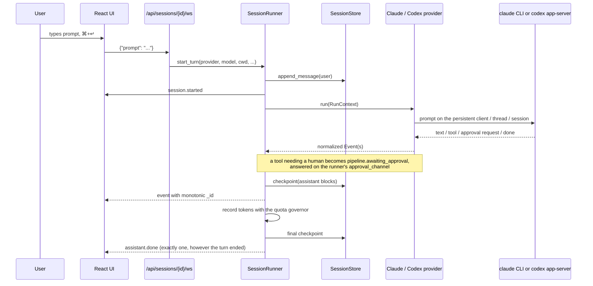
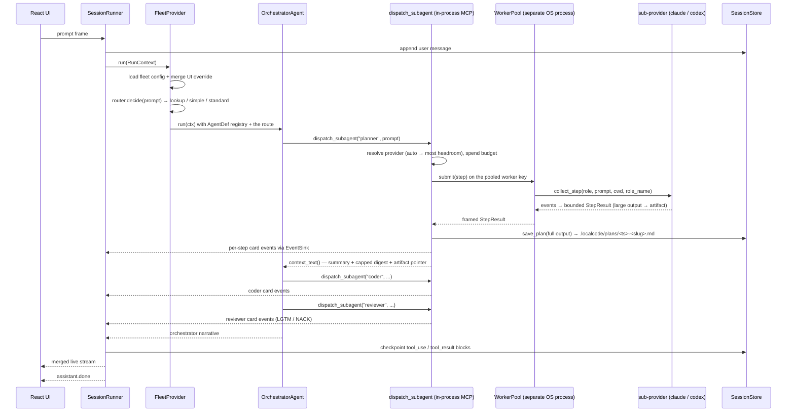
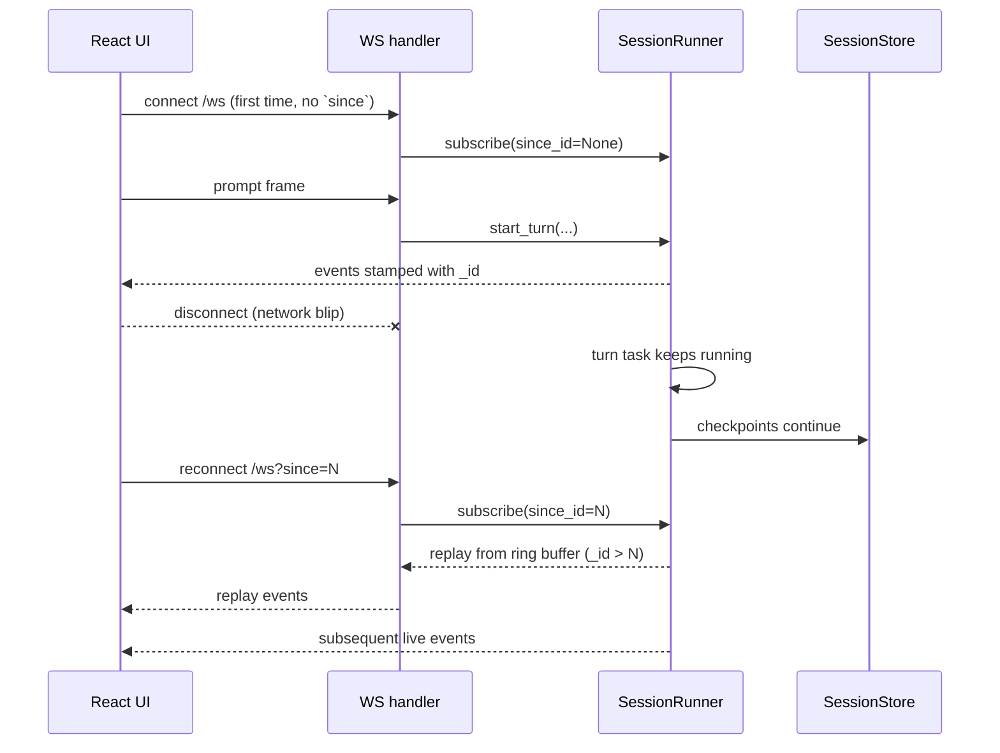
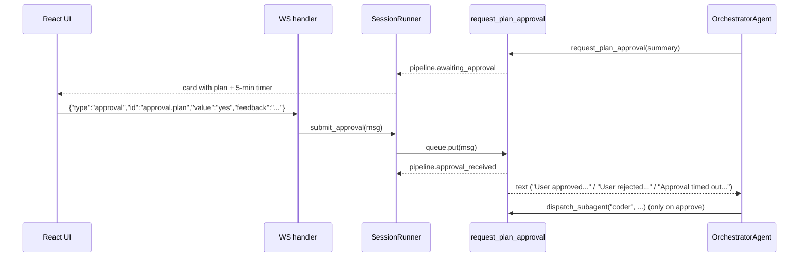

# Architecture

## Overview

LocalCode is a local, single-user coding-agent UI and orchestrator. One
Claude-Code-style web chat surface sits in front of two vendor backends plus
a fleet that composes them:

- **`claude`** — runs the official `claude` CLI through `claude-agent-sdk`,
  holding one connected client per session so the prompt cache stays warm.
- **`codex`** — speaks the `codex app-server` JSON-RPC protocol over stdio to
  the official `codex` CLI, one app-server per workspace.
- **`fleet`** — runs an LLM-driven orchestrator that delegates work to
  specialist subagents (planner / developer / coder / reviewer / tester)
  through an in-process MCP server. Subagents can be backed by either vendor
  in the same workflow, and a role configured `auto` is resolved to whichever
  subscription has the most headroom left.

The application is deliberately host-side and single-user:

- OAuth credentials stay in each upstream tool's own auth store
  (`~/.claude/` or the platform keychain for Claude Code, `~/.codex/` for
  Codex). LocalCode never sees provider API keys — a source scanner
  (`backend/app/invariants.py`) enforces that, and
  `backend/tests/test_auth_invariant.py` runs it over the whole backend.
- Sessions and planner artifacts are persisted as files on disk under
  `.localcode/`. There is **no application database**.
- A Vite/React UI connects to a FastAPI backend over REST + WebSocket.
  The backend normalizes every provider's stream into one event protocol
  and fans live events out to WebSocket subscribers.

The architectural unlocks worth naming up front:

1. A `Provider` protocol turns "which agent answered" into an
   implementation detail. The fleet is *itself* a provider, so the UI
   has no special path for multi-agent workflows.
2. A custom `dispatch_subagent` MCP tool lets one orchestrator dispatch
   subagents backed by different vendors in the same workflow — this is what
   lets you mix `claude-opus-4-7` for planning with `gpt-5.3-codex` for the
   bulk of the coding.
3. One approval bus. Each vendor has its own permission callback shape;
   all of them resolve through a single provider-neutral gate
   (`orchestrator/approvals.py`), so the user learns one approval UI and a
   deny can only be forgotten in one place.
4. One quota ledger. Remaining subscription headroom per provider is the
   number the top bar shows and the number `provider: "auto"` routes on.

[harness.md](harness.md) documents what every provider is held to, the
evaluation layers that keep it honest, and the gaps that remain.

## Tech Stack

### Backend (`pyproject.toml`)

- Python `>=3.11`.
- `fastapi >= 0.115.0`
- `uvicorn[standard] >= 0.32.0`
- `pydantic >= 2.9.0`, `pydantic-settings >= 2.6.0`
- `httpx >= 0.27.2`
- `websockets >= 13.1`
- `claude-agent-sdk >= 0.0.10`
- `python-dotenv >= 1.0.1`
- `pyyaml >= 6.0.2` (fleet config loading)
- Dev: `pytest >= 8.3.0`, `pytest-asyncio >= 0.24.0`,
  `pytest-httpx >= 0.32.0`, `ruff >= 0.7.0`, `mypy >= 1.13.0`.
- Build: `hatchling`. Package wheel includes `backend/app`.
- Ruff lint selects `E, F, I, B, UP, N, ASYNC`; line length 100.
- `pytest` asyncio mode is `auto`; `testpaths = ["backend/tests"]`
  (no tests are shipped in the repo today).

### Frontend (`frontend/package.json`)

- `react ^18.3.1`, `react-dom ^18.3.1`
- `vite ^5.4.10`, `@vitejs/plugin-react ^4.3.3`
- `typescript ^5.6.3`
- Scripts: `dev` (`vite`), `build` (`tsc -b && vite build`),
  `preview` (`vite preview`).

### VS Code Extension (`vscode-extension/package.json`)

- Plain CommonJS extension — no build step.
- VS Code engine `^1.74.0`.

### Host-side CLIs

- `claude` CLI (`npm i -g @anthropic-ai/claude-code`).
- `codex` CLI (`npm i -g @openai/codex`) — optional, and *not* installed
  automatically. Claude alone is a working install, so `setup.sh` reports a
  missing `codex` as a warning rather than a failure.

## Repository Structure

```text
.
|-- README.md                       Project overview, setup entry point
|-- Makefile                        Developer shortcuts; every Python tool runs from .venv/bin
|-- pyproject.toml                  Backend package + Python deps + ruff/pytest config
|-- setup.sh                        Host bootstrap: deps, .env, .venv, login, start/stop/status/logs
|-- .env.example                    Backend settings template
|-- .localcode/
|   |-- fleet.yaml                  Active project fleet config (planner+developer+coder+reviewer)
|   |-- fleet.yaml.example          Annotated YAML fleet-config starter
|   |-- fleet.json.example          JSON fleet-config starter
|   |-- plans/                      Planner-written Markdown implementation plans
|   `-- sessions/                   Session files for this project (uuid/meta.json + messages.jsonl)
|-- backend/
|   |-- __init__.py
|   `-- app/
|       |-- __init__.py
|       |-- main.py                 FastAPI app factory, lifespan, route registration
|       |-- config.py               Pydantic Settings, CatalogEntry, CORS/cwd allowlist
|       |-- schemas.py              REST + WebSocket Pydantic schemas
|       |-- invariants.py           Source scanner: the never-read-a-credential gate
|       |-- artifacts.py            Content-addressed store for evicted large output
|       |-- usage.py                Per-turn token log + cache-hit-rate
|       |-- quota.py                Quota governor: remaining headroom per subscription
|       |-- session_runner/         Turn lifecycle package (split by concern)
|       |   |-- config.py           Replay-ring / subscriber-queue sizes
|       |   |-- bus.py              EventBus: stamping, replay ring, fan-out, gap reports
|       |   |-- turn.py             execute_turn: the whole turn pipeline
|       |   |-- accumulator.py      TurnAccumulator: message assembly + throttled checkpoints
|       |   |-- runner.py           SessionRunner: per-session lock, approval channel, turn task
|       |   `-- registry.py         get_runner / drop_runner / detached turns
|       |-- orchestrator/
|       |   |-- __init__.py         Re-exports get_provider
|       |   |-- base.py             Provider protocol, RunContext, Event, EventType
|       |   |-- agent_def.py        AgentDef + registry_from_role_library + render_registry_for_prompt
|       |   |-- registry.py         Lazy provider singleton registry (warm_up / shutdown_all)
|       |   |-- approvals.py        The one approval bus (evaluate_tool_request + EventSink)
|       |   |-- permissions.py      ToolPolicy role table + the single decide()
|       |   |-- claude.py           ClaudeProvider — one persistent ClaudeSDKClient per session
|       |   |-- codex/              CodexProvider package (app-server JSON-RPC over stdio)
|       |   |   |-- protocol.py     Every wire name, in one file
|       |   |   |-- jsonrpc.py      StdioJsonRpc transport
|       |   |   |-- client.py       CodexAppServer + CodexBroker (one server per workspace)
|       |   |   `-- provider.py     CodexProvider + _Translator
|       |   |-- fleet/              FleetProvider package (split by concern — see below)
|       |   |   |-- __init__.py     Public-API facade (re-exports the names below)
|       |   |   |-- constants.py    VALID_ROLES/PROVIDERS, budgets, worker wire markers
|       |   |   |-- models.py       RoleConfig, FleetConfig, Step dataclasses
|       |   |   |-- prompts.py      Per-role system prompts (PLANNER_SYSTEM, …)
|       |   |   |-- presets.py      WORKFLOW_PRESETS
|       |   |   |-- defaults.py     ROLE_LIBRARY, DEFAULT_FLEET_CONFIG
|       |   |   |-- loader.py       Locate/parse/merge/cache/serialize config
|       |   |   |-- router.py       Conditional routing: lookup / simple / standard
|       |   |   |-- gate.py         Reviewer/tester verdict parser (parse_verdict)
|       |   |   |-- envelope.py     StepResult — the bounded step envelope
|       |   |   |-- collect.py      Sub-provider stream → StepResult (eviction happens here)
|       |   |   |-- pool.py         WorkerPool — long-lived sub-provider processes
|       |   |   |-- subproc.py      The worker process itself
|       |   |   `-- provider.py     FleetProvider + _run_step_with_role
|       |   |-- orchestrator.py     OrchestratorAgent — claude-agent-sdk session + merged event stream
|       |   `-- dispatch.py         In-process MCP server: dispatch_subagent + request_plan_approval
|       |-- routes/
|       |   |-- __init__.py
|       |   |-- sessions.py         REST + WebSocket for sessions
|       |   |-- models.py           GET /api/models
|       |   |-- fleet.py            GET /api/fleet/config
|       |   `-- system.py           GET /api/system/cwd, /usage, /quota
|       `-- storage/
|           |-- __init__.py
|           `-- sessions.py         SessionStore — filesystem CRUD + cleanup + compaction
|   `-- tests/                      The evaluation net — see docs/harness.md
|       |-- fakes/                  Scripted SDK client, fake codex app-server, pool workers,
|       |                           and providers.py (the fakes wrapped as Providers)
|       |-- replay/                 Hand-authored provider-message fixtures
|       |-- golden/                 Committed fleet traces (UPDATE_GOLDEN=1 to refresh)
|       `-- test_*.py               Per-module suites + replay / long-horizon / golden / matrix
|-- frontend/
|   |-- package.json                Frontend deps + scripts
|   |-- vite.config.ts              Vite config, /api → backend proxy with ws: true
|   |-- tsconfig.json / tsconfig.node.json
|   |-- index.html                  HTML shell + Google Fonts (Inter, JetBrains Mono)
|   `-- src/
|       |-- main.tsx                React entrypoint (StrictMode + createRoot)
|       |-- App.tsx                 Global state: theme/accent, sessions, models, cwd, additional_dirs
|       |-- api.ts                  REST client + openSessionSocket()
|       |-- types.ts                Shared TS types (StreamEvent, FleetConfig, etc.)
|       |-- styles.css              All UI styles
|       `-- components/
|           |-- ChatPane.tsx        Chat surface, WS lifecycle, replay, approval gate UI
|           |-- Composer.tsx        Prompt input (⌘+↵ to send)
|           |-- CrewBar.tsx         Fleet roles bar with status badges
|           |-- ErrorBoundary.tsx   React error boundary
|           |-- FleetConfigEditor.tsx Modal that emits per-session fleet override
|           |-- ProjectPicker.tsx   cwd + additional_dirs editor in the topbar
|           |-- Sidebar.tsx         Session list + model picker
|           |-- Topbar.tsx          Header (session info, theme toggle, project picker)
|           `-- icons.tsx           Inline SVG icon components
|-- vscode-extension/
|   |-- package.json                Extension contribution manifest
|   |-- extension.js                Webview sidebar/panel embedding the LocalCode UI
|   |-- README.md
|   `-- media/icon.svg              Activity-bar icon
`-- docs/
    |-- architecture.md             (this file)
    |-- harness.md                  What every provider is held to + the evaluation net
    |-- codex.md                    The codex app-server integration
    |-- fleet.md                    Fleet concept, roles, UX
    |-- fleet-config.md             Configuration UX, presets, recipes
    |-- storage.md                  Filesystem session store
    `-- vscode-integration.md       VS Code extension docs
```

No `Dockerfile`, no `docker-compose.yml`, no `.github/workflows/` are
present in the tree. The `Makefile` includes `up`/`down`/`logs`/`db-init`
targets that reference Docker Compose and `backend.app.db_init`, but
neither the compose file nor `db_init.py` exists today — those targets
are stale.

## Core Concepts

**Provider.** A protocol declared in `backend/app/orchestrator/base.py`.
Every backend exposes `open_session(ctx)`, `run(ctx)` (async iterator of
`Event`), `close_session(session_id)` and `aclose()`. Implementations:
`ClaudeProvider`, `CodexProvider`, `FleetProvider`.
`close_session` exists because a provider that keeps a live per-session handle
has to be told when a session goes away, or the handle — and the vendor CLI
behind it — outlives the session that owned it.

**`RunContext`.** Dataclass carrying everything a provider needs for one
turn: `model`, `prompt`, `cwd`, `additional_dirs`, `upstream_session_id`,
optional `system_prompt`, `permission_mode`, `session_id` (providers key
per-session state on it), `role` (the fleet role this context runs as, which
selects the `ToolPolicy`), `extras` (used by the fleet for per-session config
overrides and role-specific provider controls), and `approval_channel` (the
HITL back-channel — an `asyncio.Queue` of approval messages).

**`Event`.** Unified streaming event yielded by every provider. Types are:
`session.started`, `assistant.text`, `assistant.tool_use`, `tool.result`,
`assistant.done`, `error`, `pipeline.awaiting_approval`,
`pipeline.approval_received`, and `quota.limit` (a vendor reporting where its
rate-limit window stands — emitted by a provider, recorded only by the main
process). Plus `stream.gap`, which no provider emits — the `EventBus`
synthesizes it per subscriber to report events that subscriber lost.

**`ToolPolicy`.** What one role may touch, as data: writable, exec-allowed,
the roots it may operate in, denied paths, an allow-list and a deny-list of
tool names. Produced by `permissions.policy_for_role` and consulted by the one
gate. A role is a runtime limit, not a paragraph in a system prompt.

**Session.** A chat pinned to one provider + model + cwd. Persisted on
disk as `meta.json` + append-only `messages.jsonl`. No database.

**`SessionRunner`.** One per active session. Owns turn execution
independently of any WebSocket connection: a turn keeps running across
client disconnects, and reconnects subscribe to a bounded replay buffer.

**`AgentDef`.** The orchestrator registry entry — `name`, `description`,
`provider`, `model`, `system_prompt`, optional `permission_mode`,
optional `max_turns`. Modelled after Claude Code's `AgentDefinition`.

**Fleet.** A workflow defined by which agents it contains. The fleet
provider loads a `FleetConfig`, builds an agent registry from its
`roles`, and runs the `OrchestratorAgent`. There is no separate
"pipeline" mode — orchestrator-as-agent is the single path.

**MCP dispatch.** `dispatch.py` builds a fresh in-process MCP server per
turn exposing two tools: `dispatch_subagent(name, prompt)` and
`request_plan_approval(plan_summary)`. The orchestrator's allowed-tool
list contains *only* these two — built-in Claude Code tools (Read, Edit,
Bash, Skill, Agent, Task, etc.) are explicitly denied so the
orchestrator can't bypass the registry. The dispatch layer also preserves
per-role outputs for the turn and normalizes downstream prompts: planner
receives the original user request, coder receives the full planner
artifact, and reviewer receives both the full plan and coder result.

**Plan.** When `dispatch_subagent` is invoked with the `planner` agent,
its Markdown output is written to `<cwd>/.localcode/plans/<timestamp>-<slug>.md`
by `save_plan()` in `dispatch.py`.

## Module Responsibilities

### Backend (`backend/`)

#### `backend/app/main.py`
- `create_app()` builds the FastAPI app from `Settings.app_name`,
  installs CORS from `Settings.cors_origin_list`, registers four
  routers (`sessions`, `models`, `fleet`, `system`) and a single inline
  `/api/health` route returning `{"status": "ok", "env": s.env}`.
- The lifespan context calls `warm_up()` to construct provider
  singletons up front and `session_store.cleanup_expired(...)` to sweep
  stale sessions on startup (no-op when the 24-hour sentinel is fresh).
  Shutdown calls `drop_all_runners()` **before** `shutdown_all()`: turns
  must be cancelled while the loop and their providers are still alive,
  or the per-step `finally` that kills the sub-provider child never runs
  and the vendor CLI survives the restart as an orphan.

#### `backend/app/config.py`
- `Settings` (pydantic-settings, env file `.env`, `extra="ignore"`)
  with fields enumerated under [Configuration](#configuration).
- `CatalogEntry` parses `MODEL_CATALOG` into `(provider, model)` pairs.
  Malformed entries are silently skipped to avoid boot failures.
- `Settings.cwd_allowlist()` returns resolved `Path`s; empty allowlist
  = permissive.
- `get_settings()` is `@lru_cache(maxsize=1)`-decorated.

#### `backend/app/schemas.py`
- Request/response models: `CreateSessionRequest`, `SessionOut`,
  `MessageOut` (with a `Decimal → float` validator for legacy data),
  `MessagesPage`, `CatalogModel`, and the unified WebSocket
  `StreamEvent`.

#### `backend/app/session_runner/` (a package, not a file)

Split by concern, one-way: `config` → `bus` → `turn`/`accumulator` →
`runner` → `registry`.

| Module | Owns |
| :-- | :-- |
| `config.py` | `REPLAY_BUFFER_SIZE`, `SUBSCRIBER_QUEUE_MAX` and the relationship between them |
| `bus.py` | `EventBus` — stamping, the replay ring, per-subscriber fan-out, gap reporting |
| `turn.py` | `execute_turn` — persist the prompt, drain the provider, checkpoint, always finalize |
| `accumulator.py` | `TurnAccumulator` — assemble one assistant message, throttle checkpoints, repair dangling `tool_use` |
| `runner.py` | `SessionRunner` — the per-session lock, the approval channel, the turn task |
| `registry.py` | `get_runner` / `drop_runner` / `drop_all_runners` and detached-turn bookkeeping |

- `SessionRunner` decouples turn execution from any WebSocket
  connection. State lives on the runner, not on the WS handler.
- Constants (`config.py`): `REPLAY_BUFFER_SIZE = 2048`,
  `SUBSCRIBER_QUEUE_MAX = 512`.
  The ring must stay **larger** than a subscriber queue: it has to be able
  to cover any gap a queue can open, or `?since=` cannot hand back what a
  viewer dropped. Asserted by `backend/tests/test_event_integrity.py`.
- Public API: `subscribe(since_id)` → `Subscription(queue, replay,
  watermark)`, `unsubscribe(queue)`, `submit_approval(msg)`,
  `pending_approval`, `start_turn(...)` (rejects
  a second turn while one is running, and any turn once the runner is
  retired), `retire()` / `is_retired`, `cancel_turn()` (bounded by
  `_CANCEL_GRACE_S`; returns the turn task when it had to be detached,
  propagates a `CancelledError` raised against its own caller).
- `Subscription.watermark` is the highest `_id` stamped when the subscriber
  was registered: the boundary between "the caller must hand this over
  itself" and "the live queue will carry it". When the ring has already
  evicted past `since_id`, the replay *starts* with a `stream.gap` — a replay
  that silently begins mid-stream leaves the client appending a tail onto a
  transcript with a hole. The marker is what makes it refetch: `ChatPane`
  calls `loadMessages` on a `stream.gap`, and otherwise only on a reconnect
  where it never saw an event id (`wasReconnect && lastEventId.current === 0`).
- `execute_turn` (`turn.py`):
  - Persists the user message first — *inside* the `try`, because that is the
    one step that fails when the session directory was deleted under it, and
    when it sat outside the turn died with no `error` and no `assistant.done`.
  - Builds a `RunContext` carrying the runner's per-turn `approval_q`, the
    session id (providers key per-session state on it) and the permission mode.
  - Drains `provider.run(ctx)`:
    - `assistant.text` (non-heartbeat) accumulates into a text buffer.
    - `assistant.tool_use` flushes any buffered text, appends a
      `tool_use` block, and checkpoints.
    - `tool.result` appends a `tool_result` block and checkpoints.
    - `assistant.done` captures `cost_usd` / `duration_ms`, persists a changed
      upstream session id, and records the turn's tokens with the quota
      governor — one of exactly two recording sites (the other is
      `dispatch.py`, for a fleet sub-step).
    - `quota.limit` records a vendor's own measurement of its window.
  - Heartbeat text (`heartbeat: True`) is broadcast live but **never
    persisted** — UI chrome only.
  - On `asyncio.CancelledError` (shutdown / delete) emits an `error`
    event and re-raises; on other exceptions logs and emits `error`.
  - The `finally` block flushes trailing text, synthesizes `tool_result`
    blocks for any `tool_use` that never got one (cancellation mid-turn),
    writes a final checkpoint, and emits `assistant.done` unless the
    provider's own one already *reached the bus*. Exactly one terminal event
    per turn, however the turn ends: zero leaves every viewer's working
    indicator spinning until reload, two clears it for a turn still running.
- `TurnAccumulator` (`accumulator.py`) throttles mid-turn checkpoints. A
  checkpoint writes the *whole* message so far, so one per tool boundary cost
  O(boundaries × final size) — a 200-tool turn ending at 2 MB wrote ~200 MB.
  A write now needs the message to have grown by at least as much as the last
  write (capping total checkpoint bytes at roughly twice the final message),
  with a time arm below a 64 KiB floor so a slow, small turn is still
  recoverable.
- `EventBus.broadcast()` stamps each event with a monotonic `_id`,
  appends to the replay ring (`deque(maxlen=REPLAY_BUFFER_SIZE)`),
  notifies the optional `on_event` observer, and `put_nowait`s into every
  subscriber queue. A slow viewer still loses intermediate events — it
  can't pin the producer — but never silently:
  - Each contiguous run of drops yields that subscriber exactly one
    `stream.gap` `{dropped, resume_from}`, positioned where the loss
    began and updated in place as the run continues. Queues carry one
    slot beyond `SUBSCRIBER_QUEUE_MAX` reserved for that marker, so
    reporting a loss never causes one.
  - Terminal events (`assistant.done`, `error`) bypass the cap: if the
    queue cannot take one, the *oldest* queued event is displaced (and
    counted into the gap report). A spinner that never clears is worse
    than a missing delta.
  - A per-subscriber delivery failure is logged, never propagated:
    `execute_turn` treats a returning `broadcast` as proof the terminal
    event reached the bus, so raising here would produce a second one.
- `SessionRunner` passes `_note_event` as the bus observer to track the
  outstanding `pipeline.awaiting_approval` (`runner.pending_approval`),
  cleared on `pipeline.approval_received` or at turn end. The WS handler
  re-emits that card to a newly-subscribed viewer, after replay, so a
  reconnecting tab can answer a gate it never saw instead of waiting out
  `APPROVAL_TIMEOUT_S`. It re-emits only when the viewer cannot already be
  getting the card, judged by the card's `_id`: at or below `since_id` means
  the client rendered it before reconnecting, above the watermark means the
  live queue carries it, and present in the replay means it is already on its
  way. (Not by approval id — `dispatch` hardcodes that to `"approval.plan"`.)
- Module-level `get_runner(session_id)` is lazy + lock-guarded, and
  returns `None` for a session whose directory is gone rather than
  resurrecting it; `drop_runner(session_id)` and `drop_all_runners()`
  retire runners *before* popping them, then cancel their turns. Turns
  that outlive the grace window are kept in `_detached_turns` so
  `drop_all_runners()` can make one final attempt at shutdown.

#### `backend/app/artifacts.py`
- `ArtifactStore` — content-addressed text blobs under
  `~/.localcode/artifacts/<sha[:2]>/<sha>.txt` (tmp + `os.replace`, so a crash
  mid-write never leaves a truncated artifact that reads as complete).
  Identical content dedupes to one file.
- `store_if_large(text, kind, max_bytes)` -> `(text_or_summary, ref_or_None)`:
  under the threshold nothing is written; over it the bytes are stored once and
  the caller gets a head/tail summary (2:1 in favour of the start) with a
  marker line naming the artifact and its path.
- Budgets are **bytes**, and the cut is moved to a UTF-8 character boundary.
  A character-count budget assumes one byte per character and overshoots 3-4x
  on CJK or emoji — which is the failure this module exists to prevent, since a
  single oversized turn changes the prompt prefix for every later turn.
- The default root resolves `Path.home()` inside the constructor, never at
  import time, so a test that redirects `HOME` is actually contained.

#### `backend/app/usage.py`
- `TurnUsage` (one turn's token counts, provider, model, cost) and `UsageLog`,
  which appends one JSON line per turn to `~/.localcode/usage.jsonl`, rotating
  at 8 MB. A truncated last line (the process was killed mid-write) is skipped
  on read rather than raising.
- `parse_claude_usage(result_message, ...)` is entirely defensive: `usage` may
  be `None`, snake_case, camelCase, or malformed. Nothing here may raise — it
  runs inside the provider's per-turn loop, and an exception would turn a
  *successful* turn into an `error` event and drop its `assistant.done`.
- `cache_hit_rate` / `uncached_share` are what make the persistent-client work
  observable: without them "the prompt cache stays warm" is an unfalsifiable
  claim. Surfaced by `GET /api/system/usage`.

#### `backend/app/quota.py`
- The quota governor: **remaining subscription headroom per provider**, which
  is the number the top bar shows and the number `provider: "auto"` routes on.
  Per-turn USD bills nobody under a subscription; a spent window stops work.
- Windows are a **table** (`DEFAULT_WINDOWS`), not a branch: Claude gets a
  5-hour window, Codex a 5-hour window *and* a weekly cap, and a provider with
  no row still gets one rather than silently having no ledger.
- **Two sources, strict precedence.** A vendor-reported payload replaces
  `used`/`limit`/`resets_at` and sets `confidence="reported"`; absent that,
  tokens accumulate locally against an unknown limit and `headroom()` reads
  `1.0` with `confidence="unknown"` so the meter never draws a bar it did not
  measure. A CLI reports only on a *transition*, so absence is "no change",
  never "reset" — which is why the state is persisted to
  `~/.localcode/quota.json`.
- **Exactly one writer.** That file is read-modify-write and fleet
  sub-providers run in worker processes, so providers only ever *emit*; the two
  main-process sites that record are `session_runner/turn.py` and
  `orchestrator/dispatch.py`.
- `choose(candidates)` resolves `auto`; `should_queue` / `refusal` say "every
  governed subscription is at or below `QUEUE_THRESHOLD` (5 %) — hold this
  work" rather than silently downgrading to a spent plan.
- Nothing here may raise into a turn: a governor that estimates badly is a bad
  number, one that takes the turn down is a bad harness. Read by
  `GET /api/system/quota`; known limitations are listed in
  [harness.md](harness.md#8-the-quota-governor).

#### `backend/app/orchestrator/base.py`
- `EventType` literal, `Event` dataclass, `RunContext` dataclass,
  `Provider` protocol (see [Core Concepts](#core-concepts)).

#### `backend/app/orchestrator/registry.py`
- Lazily builds and caches singleton providers. `PROVIDER_NAMES` names them
  once — `claude`, `codex`, `fleet` — so the builder and `warm_up()` cannot
  drift: a provider in the builder but missing from `warm_up` pays its
  construction cost mid-turn, and one missing from the builder is a 500 on
  the first request that names it.
- Lock is created lazily so it binds to the running event loop (avoids
  cross-loop latching in tests).
- `warm_up()` constructs all three at startup; `shutdown_all()` calls
  `aclose()` on each.
- `_build_provider(name)` is also the seam a fleet step builds its
  sub-provider through (`fleet/collect.py` imports it inside the function, so
  the sub-provider is loop-local rather than the shared singleton).

#### `backend/app/orchestrator/claude.py`
- `ClaudeProvider` holds **one connected `ClaudeSDKClient` per LocalCode
  session**, reused across turns and keyed on `ctx.session_id`. The one-shot
  `query()` this replaced spawned a fresh `claude` CLI per message: startup
  cost every turn, a cold server-side prompt cache every turn, and no process
  left alive to `interrupt()`.
- `_signature(...)` decides reuse. A client is **rebuilt, never mutated**,
  when the model, cwd, extra dirs, system prompt, permission mode or tool set
  changes — mutating a live client's prompt prefix is what invalidates the
  cache the design exists to keep. `upstream_session_id` is deliberately NOT
  in the signature: `resume` is build-time only, and counting it would rebuild
  every session's client on turn 2.
- **Only a turn whose `ResultMessage` went past leaves a reusable client.**
  All of a connection's turns share one message stream, so a turn that ended
  early (Stop, a closed socket, a failed stream) leaves an unread tail the
  next turn would read first. "The loop ended" is not the test —
  `receive_response()` also returns at stream EOF — so `_discard` drops the
  client on anything but an observed result.
- `run()` is a **two-producer merge**, not a straight `async for`: the
  permission callback emits its approval card from inside the SDK's message
  loop and then blocks there, so a single-iterator run would hold the card in
  a frame nobody is draining and ask the user a question they cannot see.
  `_TurnBinding` holds the two per-turn halves of that callback (this turn's
  `EventSink` and approval queue) and is rebound under the handle's lock at
  the top of each turn.
- Options are derived from the role policy, and `ctx.extras` may only
  **narrow** them: allowed tools are intersected with the role's allow-list
  (and cannot create one where the role has none), disallowed tools are
  unioned with the role's denials, and a read-only role also gets
  `setting_sources=[]` / `skills=[]` so a user's own settings file cannot
  re-grant what the policy took away.
- `_translate()` maps SDK messages to events: `StreamEvent` →
  `assistant.text` (only `text_delta` deltas); `AssistantMessage` →
  `assistant.tool_use` / `tool.result` (skips `TextBlock` to avoid
  doubling the deltas); `UserMessage` → `tool.result`; `ResultMessage`
  → `assistant.done` with `cost_usd`, `duration_ms`, `num_turns`,
  `upstream_session_id` and the parsed `usage`; `RateLimitEvent` →
  `quota.limit` via `rate_limit_event()` (shared with `orchestrator.py`, so a
  user who works only in fleet sessions still gets Claude's headroom
  measured); `SystemMessage` → ignored.
- Pinned by `backend/tests/test_claude_client_reuse.py` and, for the
  translation itself, by `backend/tests/test_replay.py`'s fixtures.

#### `backend/app/orchestrator/codex/`
A package, because the app-server integration is a transport plus a protocol
plus a provider and each has a different reason to change.

- `protocol.py` — **every wire name in one file**: methods, notifications,
  server-to-client approval requests, item kinds, decisions, error codes, and
  the field spellings on both the write side (`F_*`) and the read side
  (`*_FIELDS` tuples, splatted into `pick()` so one field can carry several
  historical spellings at no cost). The app-server is explicitly experimental,
  so a schema bump must be a one-file edit plus the matching edit to the fake.
  **Every assumption in here is a reading of the documentation, not an
  observation of a live binary** — each is listed with the cost of being wrong,
  and `make codex-schema` regenerates the vendor schema for reconciliation.
- `jsonrpc.py` — `StdioJsonRpc`: newline-framed JSON-RPC over the child's
  stdio, request/response correlation, `-32001` (busy) backoff, and the rule
  that **every server request is answered**, including ones we do not
  implement — a dropped server request hangs the agent forever.
- `client.py` — `CodexAppServer` (spawn, handshake, thread lifecycle, process
  group reaping) and `CodexBroker`, which holds one app-server per *workspace*
  behind a per-workspace lock, never a process-wide one.
- `provider.py` — `CodexProvider` plus `_Translator`. The translator is
  stateful for two reasons that would otherwise show in the UI: `item/updated`
  may carry accumulated text rather than a delta (so only the new suffix is
  emitted), and a `tool.result` needs the `tool_use` that preceded it (so a
  pair is synthesized when Codex skips `item/started`). **No branch raises on
  an unknown name** — it logs once at DEBUG and skips; turning a good turn into
  an `error` because a newer CLI added an item kind is far worse than not
  rendering one reasoning block.
- Approvals go through the same `evaluate_tool_request` Claude's do, and the
  same `_TurnBinding` pattern keeps turn 2's card on turn 2's sink — the
  app-server outlives the turn, so a handler that captured turn 1's sink would
  leave every later approval to time out silently.
- Exercised end to end against `backend/tests/fakes/fake_codex_app_server.py`,
  a real subprocess speaking the protocol. See [codex.md](codex.md).

#### `backend/app/orchestrator/approvals.py`
The one approval bus, split in two deliberately.

- `evaluate_tool_request(tool_name, tool_input, *, policy, mode, sink,
  approval_channel, timeout_s)` is **provider-neutral**: a string, a mapping,
  a `ToolPolicy`, a mode, an event sink and a queue. No vendor SDK type appears
  in its signature or its body. It returns only `allow` or `deny` — it resolves
  `ask` itself by publishing `pipeline.awaiting_approval` and waiting for the
  answer, then emits `pipeline.approval_received` on **every** path (yes / no /
  timeout), because the UI clears the card on that event.
- `build_can_use_tool(...)` is a thin **Claude adapter** — outcome to result
  type, reason to the message the model reads. It holds no policy logic; a
  branch here would be a branch Codex does not get.
- `EventSink` — a bounded (256) queue with sentinel shutdown, the channel a
  tool body uses to reach the WS while it is still running.
- `_ApprovalRouter` — exactly one task reads the approval channel and hands
  each answer to the gate that asked, by id. Every waiter used to read the
  channel itself and skip messages that were not its own, which *discarded*
  them: two parallel tool calls open two gates, and gate B would eat gate A's
  answer.
- The headless answer to `ask` is **deny** (nobody is attached to say yes),
  with one exception keyed on "no channel attached": exec tools are allowed
  when the role's own policy already grants exec, or every `pytest` a fleet
  role runs would refuse.

#### `backend/app/orchestrator/permissions.py`
Pure policy: zero I/O beyond `Path.resolve()`, no SDK import, no events — so
the same table can be driven by a list of test cases and serves both vendors
instead of each reinventing its own gate.

- `ToolPolicy(name, writable, exec_allowed, roots, denied, allow_tools,
  deny_tools, ask_tools)` and the role table behind
  `policy_for_role(role, roots, denied)`: planner, developer and reviewer are
  read-only, coder and tester may write, planner and developer may not execute.
  A role with no entry gets the permissive "session" policy.
- `decide(tool_name, tool_input, policy, *, mode)` -> `allow` / `deny` / `ask`.
  **Branch order is security-critical**: explicit deny, then the allow-list,
  then writability, then exec, then the path check — and only *then*
  `bypassPermissions`. A mode is a human-in-the-loop preference, not a
  structural override; if the bypass branch ran first, enabling it would hand
  a read-only reviewer write access.
- `acceptEdits` auto-approves writes only, never exec: `ctx.role` is unset for
  interactive sessions and `acceptEdits` is the UI default, so widening it
  would auto-approve every shell command in a plain chat with no card shown.
- `normalize_permission_mode` folds an unknown mode to `default` (ask), never
  to something more permissive.
- `policy_extras(policy)` renders a policy into the vendor extras `claude.py`
  reads, so the tool list a sub-agent is *offered* and the decision made when
  it calls one are two renderings of one policy rather than two policies.

#### `backend/app/orchestrator/fleet/`

Originally one ~1k-line `fleet.py`; split into a package by concern. The
import surface is unchanged — `fleet/__init__.py` is a facade that
re-exports every previously-importable name (including back-compat
aliases `_classify_gate`, `_collect_text`, `_merge_config`), so external
importers (`routes/fleet.py`, `registry.py`, `dispatch.py`) are
untouched. Dependency flow is one-way:
`constants → models → defaults → loader/provider`; the cross-package
imports (`registry`, `agent_def`, `orchestrator`) stay lazy to avoid
cycles. Submodules: `constants`, `models`, `prompts`, `presets`,
`defaults`, `loader`, `router`, `gate`, `collect`, `envelope`, `pool`,
`subproc`, `provider`.

- Constants (`fleet/constants.py`):
  - `VALID_PROVIDERS = ("claude", "codex")`
  - `AUTO_PROVIDER = "auto"` — deliberately **not** a member of
    `VALID_PROVIDERS`: it names no backend, and everything downstream of
    `dispatch_subagent` must only ever see a real one. The quota governor
    resolves it at the single site where a role becomes a `RoleConfig`.
  - `VALID_ROLES = ("planner", "developer", "coder", "reviewer", "tester")`
  - `WORKER_ROLES = ("developer", "coder", "reviewer", "tester")`
  - `HEARTBEAT_INTERVAL_S = 30.0`, `STEP_TIMEOUT_S = 600.0`,
    `STARTUP_GRACE_S = 75.0`, `DISPATCH_HARD_FAIL_CAP = 2`. The two timeouts
    are **fallbacks, not the effective values**: `fleet/provider.py` reads
    `fleet_step_timeout_s` (1200 s) and `fleet_startup_grace_s` (90 s) from
    settings, and a running step is bounded by those. The constants apply only
    where no settings object is in hand.
  - The worker wire protocol's markers (`FIRST_MARKER`, `RESULT_MARKER`,
    `WORKER_STDOUT_LIMIT`, `WORKER_PID_DIR_ENV`), shared by the pool and
    `subproc.py` so neither side can drift by editing its own copy.
- `WORKFLOW_PRESETS`: 10 named presets the UI exposes as one-click
  starters (`full`, `plan-code-review-test`, `plan-code-test`,
  `plan-and-code`, `design-and-code`, `design-only`, `code-and-review`,
  `code-only`, `plan-only`, `review-only`).
- `RoleConfig(provider, model, system_prompt)` and `FleetConfig`
  (`name`, `roles`, `entry_role`, `max_steps=6`,
  `max_review_retries=1`, `require_plan_approval=False`,
  `config_source`).
- `ROLE_LIBRARY` (`fleet/defaults.py`) — built-in default `RoleConfig`
  per role with carefully scoped system prompts from `fleet/prompts.py`
  (`PLANNER_SYSTEM`, etc.).
- `DEFAULT_FLEET_CONFIG` (`fleet/defaults.py`) — `planner + coder +
  reviewer + tester`, `entry_role="coder"`.
- `WORKFLOW_PRESETS` lives in `fleet/presets.py`; `RoleConfig` /
  `FleetConfig` / `Step` in `fleet/models.py`.
- `load_fleet_config(cwd)` (`fleet/loader.py`) walks the candidate list (see
  [Configuration](#configuration)), parses YAML/JSON, merges through
  `_merge_config`, and caches by `(path, mtime)` in a 16-entry FIFO
  cache. Invalid fields are dropped with a warning rather than failing.
- `_merge_config` (`fleet/loader.py`) semantics: when `override["roles"]` is supplied it
  *replaces* workflow membership; otherwise base membership survives
  and per-field overrides merge.
- `FleetProvider` (`fleet/provider.py`). `run()` loads file config
  (asynchronously — a cache miss parses YAML, and a synchronous parse on the
  turn's loop stalls every other session's streaming), merges any per-session
  UI override (`ctx.extras["fleet_config_override"]`), and dispatches to
  `_run_orchestrated()`. That classifies the prompt with `router.decide`,
  builds an `AgentDef` registry via `registry_from_role_library(cfg.roles)`,
  instantiates `OrchestratorAgent` with the route, and yields the merged
  stream. **The orchestrator prompt no longer mandates the full crew on every
  turn** — the route decides, and only `always_full_crew` restores the old
  mandatory paragraph. Ends with **exactly one** `assistant.done`: the
  orchestrator's own (the only event carrying `cost_usd`) re-emitted with the
  turn's `duration_ms` merged in, or — if the orchestrator never got that far —
  one synthesized here.
- All per-turn state lives as locals in `run()`: `FleetProvider` is a
  singleton and concurrent turns share `self`. The one exception is the
  `WorkerPool`, which holds no turn state (its keys carry the session) and must
  outlive a turn or the pooling buys nothing.
- `_run_step_with_role(step, role_cfg, ctx, outputs)` is the per-role
  executor that the MCP `dispatch_subagent` tool delegates to:
  - Emits a visible `assistant.tool_use` (name
    `"<role> [<provider>:<model>]"`, input `{prompt: <≤600 chars>}`). The
    provider in that name is the **resolved** one, so a role configured `auto`
    shows which subscription actually served the step.
  - Submits the step to the `WorkerPool` (see `fleet/pool.py`) and waits on
    `(first, result)`, narrating the wait every `HEARTBEAT_INTERVAL_S` with a
    heartbeat whose wording depends on what is actually known: "still working"
    only once the worker has produced output, "queued behind another step"
    when it has not reached a worker, and "no response yet" otherwise. A
    comforting lie is a lie the user acts on.
  - **Fast-fails** on zero output within `fleet_startup_grace_s` — a wedged
    backend (auth prompt, dead socket, nested-SDK deadlock) is not a slow
    model, and the message says so. `fleet_step_timeout_s` is the absolute
    ceiling for a backend that streams but never finishes; a step still
    *queued* at that point raises `StepNotAttemptedError` instead, because it
    never reached a sub-provider and must not count against the retry cap.
  - Records the step's `StepResult` **envelope** (not its text) in `outputs`,
    so the caller can have both the bounded `context_text()` and, through the
    artifact, the complete output.
  - Marks the `tool.result` `is_error=True` for a gate role whose verdict is
    not `lgtm`, preferring the verdict the step already parsed from its full
    output over a re-parse of the bounded text.
  - In its `finally`, cancels and `abandon`s only an **unresolved** request. A
    resolved future — success or a structured error the worker reported — means
    the worker answered and is healthy, so it stays in the pool; killing it
    unconditionally would give back the interpreter-start cost the pool exists
    to remove.
- `collect_step()` (`fleet/collect.py`) drives one sub-provider to completion
  and reduces its event stream to a `StepResult`: a capped summary, a capped
  tool digest, the parsed verdict for a gate role, the reported token usage,
  and a pointer to the artifact holding the full output when it was too large
  to inline. **Eviction happens here, once, on the way out of the step** — not
  at each consumer, where one forgetful caller is all it takes to put the
  megabytes back. `collect_text()` remains as a thin wrapper over
  `collect_step(...).context_text()`.
- `collect_step` builds a **fresh** provider via `registry._build_provider`
  rather than the shared singleton (whose lock is bound to the main loop) and
  sets `ctx.role`, which is what makes the role policy apply at all: before
  that was set, every sub-agent ran under the permissive "session" policy and
  the role table enforced nothing. The role's extras come from
  `permissions.policy_extras`, the same table the gate consults.
- An `error` event from a sub-provider raises `RuntimeError`: a step that
  *failed* must not be reported as a step that produced nothing, because "no
  output" is a state the pipeline tries to recover from by re-prompting.
- A `quota.limit` a sub-provider emits inside a worker is **dropped** — the
  worker's only channels home are `@@FIRST@@` and the framed `StepResult`.
  The step's tokens still reach the governor via `StepResult.usage`; see
  [harness.md](harness.md#8-the-quota-governor).
- `classify_gate(output, role)` (`fleet/gate.py`, aliased
  `_classify_gate`) strips the tool digest, walks the
  body backwards for the last classifier-shaped line, tolerates
  Markdown decoration, and returns `"lgtm"`, `"nack"`, `"nack_code"`,
  or `"nack_tests"`. Fail-safe: unclassified reviewer output is
  `"nack"`; unclassified tester output is `"nack_code"`.

#### `backend/app/orchestrator/fleet/pool.py`
- `WorkerPool` — long-lived sub-provider worker **processes**, keyed by
  `worker_key(session_id, provider, model, cwd)`. The process boundary is not
  an optimisation: driving a second `claude_agent_sdk.query()` from inside the
  orchestrator's own MCP tool callback deadlocks the SDK (its async-generator
  state is process-global, so a thread with its own loop does not help), and a
  child process is the only thing that lets the parent truly kill a wedged
  vendor CLI.
- The processes are **pooled** because interpreter start + SDK import + CLI
  spawn cost 0.7-1.0 s per step. What is reused is the *process*; each request
  builds a fresh sub-provider, so one role's context cannot leak into the next.
- `submit(key, request)` returns `(first, result)` and blocks on neither the
  spawn nor the write — the caller must reach the loop that bounds and narrates
  the wait. `is_queued` distinguishes "the backend said nothing" from "nothing
  has been asked of it yet", so a queued step is never blamed on its backend.
  `abandon` reclaims only what one request holds; `kill` takes the key's worker.
- Results are **length-prefixed** (`@@RESULT@@ <id> <bytes>`), not
  newline-terminated: the old framing made correctness depend on an
  undocumented 64 KiB reader limit, and a 512 KiB plan wedged the parent.
- Every worker is spawned with `start_new_session=True` and reclaimed by
  signalling the process *group* on the pgid captured at spawn — the vendor CLI
  is the worker's child, and ending the leader alone re-parents a paid CLI to
  `launchd`. Each worker also writes a pidfile so an unclean backend shutdown's
  orphans are swept on the next pool start.

#### `backend/app/orchestrator/fleet/router.py`
- `classify(prompt)` -> `lookup` / `simple` / `standard` and
  `decide(prompt, available_roles, *, always_full_crew)` -> a frozen
  `RouteDecision(task_class, agents, rationale)`. **No model call** — regex and
  length only, so the decision is deterministic, free, and printable into a log
  line an operator can argue with.
- Three commitments: ambiguity resolves **upward** (over-spending is
  recoverable, under-planning is not); a prompt shaped like a question is never
  `simple`, whatever verb it happens to contain; and a prompt carrying both an
  ask and a mutation verb is two units of work, so `standard`.
- `MUTATION_VERBS` is closed and deliberately broad — it includes ordinary
  nouns like `handle`, `run` and `set` — which is safe **only** because
  `simple` is gated on the question-shape test. Code (fenced blocks *and*
  inline spans) is stripped before matching, so a pasted diff is not read as a
  work order.
- `render_routing_block(decision)` renders the decision into the orchestrator's
  system prompt as an instruction with both directions pinned: escalation
  allowed, de-escalation forbidden. `always_full_crew` renders the pre-routing
  paragraph verbatim, character for character.
- The class table is in [harness.md](harness.md#7-conditional-routing); the
  goldens in `backend/tests/golden/` are the standing regression net.

#### `backend/app/orchestrator/fleet/envelope.py`
- `StepResult(summary, structured, artifact_id, artifact_path, tool_digest,
  full_bytes, usage)` — the bounded envelope one step hands back. It separates
  what the orchestrator *reads* (`context_text()`: summary + capped tool digest
  + a pointer to the evicted full output) from what it *routes on*
  (`structured`, the already-parsed gate verdict, so no consumer re-parses
  prose).
- `context_text()` is deliberately the **only** place that decides what an
  orchestrator sees. Implemented per-caller it drifts, and the caller that
  forgets is the one that blows the context window.
- `to_wire` / `from_wire` speak plain JSON types because the envelope crosses
  the worker process boundary. `from_wire` tolerates missing keys and coerces
  `usage` to `dict[str, int]` rather than raising: a `KeyError` or `TypeError`
  here surfaces in the parent's stdout pump as the useless "worker exited
  without a result" instead of the partial result it actually received.

#### `backend/app/orchestrator/agent_def.py`
- `AgentDef` dataclass — `name`, `description`, `provider`, `model`,
  `system_prompt`, optional `permission_mode`, optional `max_turns`,
  free-form `metadata`.
- `registry_from_role_library(role_library)` converts the legacy
  `RoleConfig` dict into an `AgentDef` registry, baking in canonical
  descriptions for each role.
- `render_registry_for_prompt(registry)` renders the registry as a
  Markdown bullet list for the orchestrator's system prompt
  (`- \`name\` (provider:model) — description`).

#### `backend/app/orchestrator/orchestrator.py`
- `DEFAULT_ORCHESTRATOR_MODEL = "claude-sonnet-4-6"`,
  `DEFAULT_ORCHESTRATOR_MAX_TURNS = 30`.
- `ORCHESTRATOR_SYSTEM` is the system prompt; `HITL_BLOCK` is injected
  between planner and coder dispatch steps when
  `require_plan_approval` is true.
- `OrchestratorAgent.run(ctx)`:
  - Builds a fresh MCP server via `build_dispatch_mcp(...)`.
  - Wires `ClaudeAgentOptions` with `mcp_servers={"fleet_dispatch":
    mcp_server}`, `allowed_tools` containing **only** the two MCP tool
    names, `setting_sources=[]` (so user/project Claude Code settings
    can't re-grant built-in tools), and an explicit `disallowed_tools`
    list covering `Read, Edit, Write, MultiEdit, Bash, BashOutput,
    KillBash, Glob, Grep, WebFetch, WebSearch, Skill, Agent, Task,
    TodoWrite, ExitPlanMode, EnterPlanMode, NotebookEdit, ToolSearch`.
  - `permission_mode="default"`, `max_turns=self.max_turns`,
    `include_partial_messages=True`.
  - Two concurrent producers feed a single merged `asyncio.Queue`:
    `_pump_orchestrator()` drains the SDK iterator through
    `_translate_orchestrator_message` (suppresses the
    `dispatch_subagent` / `request_plan_approval` tool_use cards —
    those bodies emit their own per-role events); `_pump_sink()`
    drains the `EventSink` populated by the dispatch tool bodies.
  - A third task seals the queue when both producers finish; the
    consumer cancels everything on early exit.

#### `backend/app/orchestrator/dispatch.py`
- `APPROVAL_TIMEOUT_S = 300.0`.
- `EventSink` — bounded (256) `asyncio.Queue` with sentinel-based
  `close()`.
- `build_dispatch_mcp(registry, ctx, sink, run_step_fn)` returns
  `(mcp_server, allowed_tool_names)` where the tool names are
  `mcp__fleet_dispatch__dispatch_subagent` and
  `mcp__fleet_dispatch__request_plan_approval`. A fresh server is
  built per turn so closures capture this turn's `registry/ctx/sink`.
  The closure also keeps a `role_outputs` ledger so later roles can receive
  the full upstream artifacts even if the orchestrator abbreviates a dispatch
  prompt.
- `dispatch_subagent(name, prompt)`:
  - Validates `name` against the registry; returns an `is_error` text
    payload otherwise.
  - Rewrites the effective prompt by role before running the subagent:
    planner receives `ctx.prompt` exactly, coder receives its dispatch prompt
    plus the full planner artifact, and reviewer receives its dispatch prompt
    plus both the full planner artifact and coder result. This keeps the
    mandatory planner → coder → reviewer contract deterministic even though
    the orchestrator is an LLM.
  - Builds a `RoleConfig` from the `AgentDef`, a `Step` with an id
    like `orch.<agent>.<n>`, runs `run_step_fn(step, role_cfg, ctx,
    outputs)`, and pushes every yielded event onto the sink.
  - Returns the subagent's final text. When `agent.name == "planner"`,
    `save_plan(result, ctx.cwd)` writes
    `<cwd>/.localcode/plans/YYYYMMDD-HHMMSS-<slug>.md` and the path is
    appended to the returned text.
  - Records each successful role result in `role_outputs` for downstream
    prompt normalization.
- `request_plan_approval(plan_summary)`:
  - If `ctx.approval_channel is None` (headless / no WS), auto-approves
    so unit tests and direct provider usage don't deadlock.
  - Otherwise pushes a `pipeline.awaiting_approval` event onto the
    sink and `await_approval()` blocks on the channel for up to
    `APPROVAL_TIMEOUT_S`, dropping stale messages whose `id` doesn't
    match. Emits a `pipeline.approval_received` event with the
    decision, then returns one of three orchestrator-readable text
    payloads (`"User approved..."`, `"User rejected the plan..."`,
    `"Approval timed out..."`).
- `slugify_plan_title(plan_text)` extracts the first H1 and slugifies
  to a 60-char filename-safe string; falls back to `"plan"`.
- `StepIdSequence` hands out `orch.<agent>.<n>` step ids and is built
  per turn inside `build_dispatch_mcp` (alongside `hard_fail`), so the
  counters die with the turn instead of accumulating one key per role
  for the life of the process.

#### `backend/app/routes/sessions.py`
- Prefix `/api/sessions`.
- REST: `GET /` (list), `POST /` (create), `DELETE /` (wipe all and
  `drop_all_runners()`), `GET /{id}/messages` (paginated, `before` +
  `limit`), `DELETE /{id}` (404 if absent, `drop_runner` after).
- `_validate_cwd(cwd)` and `_validate_additional_dirs(dirs)` resolve
  each path with `Path(...).expanduser().resolve()` and check
  containment in `Settings.cwd_allowlist()` (empty = permissive).
  Rejected paths return HTTP 400.
- WebSocket `/{id}/ws`:
  - Constants: `WS_IDLE_TIMEOUT_S = 30 * 60`,
    `WS_HEARTBEAT_INTERVAL_S = 30`.
  - Resolves the session metadata, subscribes a runner (with optional
    `?since=<id>` replay), forwards replay events synchronously,
    re-emits `runner.pending_approval` when a gate is outstanding and no
    other path is delivering the card (see `SessionRunner` above), then
    spawns two background tasks: `_ws_heartbeat(ws)` (server-initiated
    `{"type":"ping"}` every 30s) and `_forward_events()` (drains the
    subscriber queue to the socket).
  - Main loop reads frames with a 30-minute idle timeout. Frame
    handling: `{"type":"ping"|"pong"}` is keepalive; `{"type":
    "approval", ...}` is forwarded to `runner.submit_approval`;
    anything else with a non-empty `prompt` calls
    `runner.start_turn(...)` and rejects (synchronously) when a turn
    is already running.

#### `backend/app/routes/models.py`
- `GET /api/models` returns `Settings.catalog()` as a list of
  `CatalogModel`.

#### `backend/app/routes/fleet.py`
- `GET /api/fleet/config` returns
  `{config, is_default, valid_providers, valid_roles, role_library,
  presets, defaults}` — everything the React editor needs.

#### `backend/app/routes/system.py`
- `GET /api/system/usage` — a read-only snapshot of the raw per-turn log
  (`usage.py`) over a fixed one-hour window, including the cache hit rate.
- `GET /api/system/quota` — remaining headroom per subscription, read from the
  **same** `get_governor()` the recording sites write through, so the meter
  cannot drift onto a different ledger than the turns. `queue_suggested` is
  advice, not a queue: "every governed subscription is at or below the
  threshold, so hold this work rather than starting it".
- `GET /api/system/cwd` returns
  `{cwd, home, allowed_roots, permissive}` so the UI can choose a
  sensible default project root.

#### `backend/app/storage/sessions.py`
- Paths:
  - `USER_GLOBAL_DIR = ~/.localcode`
  - `INDEX_PATH = ~/.localcode/sessions-index.json`
  - `GLOBAL_SESSIONS_DIR = ~/.localcode/sessions/_global`
  - `CLEANUP_SENTINEL = ~/.localcode/sessions/.last-cleanup`
  - `CLEANUP_INTERVAL_S = 24*3600`
- `SessionStore` class — per-session CRUD plus `cleanup_expired`.
  Module exports a singleton `store = SessionStore()`.
- Per-session layout:
  - With cwd: `<cwd>/.localcode/sessions/<uuid>/{meta.json,
    messages.jsonl}`.
  - Without cwd: `~/.localcode/sessions/_global/<uuid>/...`.
- Atomicity:
  - `meta.json` and the index are written via `_atomic_write_text` —
    `.tmp` + fsync + `rename`.
  - `messages.jsonl` is opened in append mode; POSIX append is atomic
    for writes ≤ `PIPE_BUF`, and turns within a process serialise via
    the per-session runner lock.
- Mid-turn checkpoints append repeated message ids; `list_messages`
  dedups by id keeping the latest line, sorts by `created_at`,
  filters by `before`, and returns trailing-window pagination.
- `cleanup_expired(retention_days, force)` is bounded by the 24h
  sentinel; on each kept session it runs `_compact_messages()` to
  collapse the JSONL to one line per id.

### Frontend (`frontend/`)

#### `frontend/vite.config.ts`
- Vite proxy: `/api → http://localhost:8080` with `ws: true` so REST
  and WebSocket upgrades both flow through `/api/...`.

#### `frontend/src/main.tsx`
- React entrypoint — `createRoot(document.getElementById("root"))` and
  renders `<App />` in `<StrictMode>`. Imports `./styles.css`.

#### `frontend/src/App.tsx`
- Owns global state: `theme` (`light`/`dark`), `accent`
  (`clay`/`violet`/`blue`), `sidebarOpen`, `models`, `sessions`,
  `activeId`, `pendingModelId`, `cwd` (override),
  `defaultCwd` (from `/api/system/cwd`), `additionalDirs`,
  `fleetEditorOpen`.
- localStorage keys: `lc-theme`, `lc-accent`, `lc-cwd`, `lc-add-dirs`.
- Boot effect fans out `Promise.all([listModels, listSessions,
  systemCwd])`.
- ⌘+N keyboard shortcut → new chat.
- `onCreate()` opens the FleetConfigEditor when the pending model's
  provider is `fleet`; otherwise creates immediately via
  `createWithOverride(null)`.

#### `frontend/src/api.ts`
- REST client (`api.listModels`, `listSessions`, `createSession`,
  `fleetConfig`, `systemCwd`, `getMessages`, `deleteSession`,
  `deleteAllSessions`).
- `openSessionSocket(sessionId, sinceId?)` opens
  `ws[s]://<host>/api/sessions/<id>/ws[?since=<n>]`.

#### `frontend/src/types.ts`
- Shared TS types: `Provider`, `CatalogModel`, `SessionRow`,
  `MessagesPage`, `FleetRole`, `FleetRoleConfig`, `FleetConfig`,
  `WorkflowPreset`, `FleetConfigResponse`, `FleetConfigOverride`,
  `StreamEvent`, `WsClientMessage`, `ChatBlock`, `ChatTurn`,
  `RoleStatus`.

#### `frontend/src/components/ChatPane.tsx`
- Hydrates persisted messages via `api.getMessages` on session change,
  detecting mid-turn state (a trailing assistant turn with unfulfilled
  `tool_use` blocks) and marking it `inProgress` so live events
  continue extending the same turn.
- Manages WS lifecycle with exponential backoff (`min(1000 * 2^attempt,
  8000)` ms) and replay via `lastEventId.current`. On reconnect prefers
  replay; falls back to `loadMessages` only when it never saw an event id
  (`wasReconnect && lastEventId.current === 0`) — not when the replay comes
  back empty, which it cannot detect.
- Handles inbound events: `assistant.text` accumulates into a text
  block; `assistant.tool_use` and `tool.result` produce paired blocks;
  `pipeline.awaiting_approval` materialises a tool_use + tool_result
  pair *and* sets `pendingApproval` for the live approval card;
  `stream.gap` means this viewer's server-side queue overflowed, so it
  refetches the persisted log via `loadMessages` rather than rendering a
  hole.
- `respondApproval(value, feedback)` sends `{type: "approval", id,
  value, feedback?}` and clears the card optimistically.
- `deriveRoleStatuses()` walks the latest assistant turn and produces
  `Partial<Record<FleetRole, RoleStatus>>` for the CrewBar.
- `mergeFleetOverride()` mirrors the backend `_merge_config` semantics
  client-side so the CrewBar reflects the per-session override.

#### `frontend/src/components/Composer.tsx`
Prompt input; ⌘+↵ to send (sends through `ChatPane.send`).

#### `frontend/src/components/CrewBar.tsx`
Renders the fleet's roles with per-role status badges (running / done /
error) and a role filter.

#### `frontend/src/components/FleetConfigEditor.tsx`
Modal driven by `GET /api/fleet/config`. Lets the user pick a workflow
preset and tweak per-role `provider`/`model`/`system_prompt`. Emits a
minimal `FleetConfigOverride` (only changed fields) that is attached to
the next `POST /api/sessions`.

#### `frontend/src/components/ProjectPicker.tsx`
Edits the primary `cwd` plus the additional-dirs grant list. Triggered
from the topbar.

#### `frontend/src/components/Sidebar.tsx`, `Topbar.tsx`, `ErrorBoundary.tsx`, `icons.tsx`, `styles.css`
Standard chat-shell pieces: session list + model picker, top header,
error boundary, inline SVG icons, full UI styling.

### VS Code Extension (`vscode-extension/`)

`extension.js` embeds the LocalCode frontend in a VS Code webview:

- Activity-bar `viewsContainer` (`localcode`) with a single webview
  view (`localcode.chat`).
- Three commands: `localcode.open` (editor-area panel beside the
  current editor), `localcode.openSidebar` (focus the sidebar view),
  `localcode.reload` (rebuild webview HTML).
- The wrapper page is just an iframe pointing at `localcode.url`
  (default `http://localhost:5173`). `portMapping` tunnels two
  ports: 5173 (vite) and `localcode.backendPort` (default 8080) — so the
  iframe's WebSocket and `fetch` calls can reach the host processes from the
  synthetic webview origin.
- Configuration runtime updates: a `onDidChangeConfiguration` listener
  refreshes both surfaces when `localcode.url` or
  `localcode.backendPort` changes.
- The extension does *not* start the LocalCode backend or frontend —
  it assumes `./setup.sh` is already running.

### Fleet / Multi-Agent System (`.localcode/`)

- `.localcode/fleet.yaml` is the **active** project fleet config. The
  shipped version configures four roles (planner, developer, coder,
  reviewer), `max_steps: 4`, `entry_role: coder`, and **no tester**.
  It differs intentionally from `DEFAULT_FLEET_CONFIG` (which has
  planner + coder + reviewer + tester).
- `.localcode/fleet.yaml.example` and `.localcode/fleet.json.example`
  are annotated starters covering the full schema.
- `.localcode/plans/` is where `dispatch.py:save_plan` writes planner
  output: `YYYYMMDD-HHMMSS-<slug>.md`.
- `.localcode/sessions/` holds project-local session directories
  (`<uuid>/meta.json` + `messages.jsonl`).

## Data Flow

### Standard chat request (single-vendor provider)


```mermaid
sequenceDiagram
    participant U as User
    participant UI as React UI
    participant WS as /api/sessions/{id}/ws
    participant R as SessionRunner
    participant S as SessionStore
    participant P as Claude / Codex provider
    participant Up as claude CLI or codex app-server

    U->>UI: types prompt, ⌘+↵
    UI->>WS: {"prompt": "..."}
    WS->>R: start_turn(provider, model, cwd, ...)
    R->>S: append_message(user)
    R->>UI: session.started
    R->>P: run(RunContext)
    P->>Up: prompt on the persistent client / thread / session
    Up-->>P: text / tool / approval request / done
    P-->>R: normalized Event(s)
    Note over P,R: a tool needing a human becomes pipeline.awaiting_approval,<br/>answered on the runner's approval_channel
    R->>S: checkpoint(assistant blocks)
    R-->>UI: event with monotonic _id
    R->>R: record tokens with the quota governor
    R->>S: final checkpoint
    R-->>UI: assistant.done (exactly one, however the turn ended)
```

### Fleet orchestration request (planner → coder → reviewer)


```mermaid
sequenceDiagram
    participant UI as React UI
    participant R as SessionRunner
    participant F as FleetProvider
    participant O as OrchestratorAgent
    participant MCP as dispatch_subagent (in-process MCP)
    participant W as WorkerPool (separate OS process)
    participant Sub as sub-provider (claude / codex)
    participant S as SessionStore

    UI->>R: prompt frame
    R->>S: append user message
    R->>F: run(RunContext)
    F->>F: load fleet config + merge UI override
    F->>F: router.decide(prompt) → lookup / simple / standard
    F->>O: run(ctx) with AgentDef registry + the route
    O->>MCP: dispatch_subagent("planner", prompt)
    MCP->>MCP: resolve provider (auto → most headroom), spend budget
    MCP->>W: submit(step) on the pooled worker key
    W->>Sub: collect_step(role, prompt, cwd, role_name)
    Sub-->>W: events → bounded StepResult (large output → artifact)
    W-->>MCP: framed StepResult
    MCP->>S: save_plan(full output) → .localcode/plans/<ts>-<slug>.md
    MCP-->>R: per-step card events via EventSink
    MCP-->>O: context_text() — summary + capped digest + artifact pointer
    O->>MCP: dispatch_subagent("coder", ...)
    MCP-->>R: coder card events
    O->>MCP: dispatch_subagent("reviewer", ...)
    MCP-->>R: reviewer card events (LGTM / NACK)
    O-->>R: orchestrator narrative
    R->>S: checkpoint tool_use / tool_result blocks
    R-->>UI: merged live stream
    R-->>UI: assistant.done
```

### WebSocket reconnect with replay


```mermaid
sequenceDiagram
    participant UI as React UI
    participant WS as WS handler
    participant R as SessionRunner
    participant S as SessionStore

    UI->>WS: connect /ws (first time, no `since`)
    WS->>R: subscribe(since_id=None)
    UI->>WS: prompt frame
    WS->>R: start_turn(...)
    R-->>UI: events stamped with _id
    UI--xWS: disconnect (network blip)
    R->>R: turn task keeps running
    R->>S: checkpoints continue
    UI->>WS: reconnect /ws?since=N
    WS->>R: subscribe(since_id=N)
    R-->>WS: replay from ring buffer (_id > N)
    WS-->>UI: replay events
    R-->>UI: subsequent live events
```

### Plan approval (HITL)


```mermaid
sequenceDiagram
    participant UI as React UI
    participant WS as WS handler
    participant R as SessionRunner
    participant MCP as request_plan_approval
    participant O as OrchestratorAgent

    O->>MCP: request_plan_approval(summary)
    MCP-->>R: pipeline.awaiting_approval
    R-->>UI: card with plan + 5-min timer
    UI->>WS: {"type":"approval","id":"approval.plan","value":"yes","feedback":"..."}
    WS->>R: submit_approval(msg)
    R->>MCP: queue.put(msg)
    MCP-->>R: pipeline.approval_received
    MCP-->>O: text ("User approved..." / "User rejected..." / "Approval timed out...")
    O->>MCP: dispatch_subagent("coder", ...)   (only on approve)
```

## Agent & Fleet Architecture

The `fleet` provider *is* a provider — the WebSocket layer doesn't have
any branch for "is this multi-agent?". The fleet provider just yields
the same `Event` stream as Claude or Codex.

### Single-path orchestration

`FleetProvider.run()` always routes through `_run_orchestrated()`:

1. `load_fleet_config(ctx.cwd)` walks the candidate paths (see
   [Configuration](#configuration)) and returns a validated
   `FleetConfig`.
2. Any per-session UI override (`ctx.extras["fleet_config_override"]`)
   is merged via `_merge_config()`. `config_source` becomes
   `"<base> + UI override"`.
3. `registry_from_role_library(cfg.roles)` produces a
   `dict[name, AgentDef]`.
4. `OrchestratorAgent(registry, run_step_fn,
   require_plan_approval=cfg.require_plan_approval)` runs and yields
   events.
5. Exactly one terminal `assistant.done`, carrying `duration_ms` plus
   whatever the orchestrator reported (`cost_usd`, `num_turns`). Two
   dones would have the accumulator persist the last one, which is how
   fleet turns used to lose their cost.

There is no separate "single-agent" or "linear pipeline" branch — the
orchestrator handles a one-role registry the same way it handles a
five-role one.

### Built-in role library defaults (`ROLE_LIBRARY`)

| Role | Provider | Model |
| --- | --- | --- |
| `planner` | `claude` | `claude-opus-4-7` |
| `developer` | `claude` | `claude-sonnet-4-6` |
| `coder` | `claude` | `claude-sonnet-4-6` |
| `tester` | `claude` | `claude-haiku-4-5` |
| `reviewer` | `claude` | `claude-sonnet-4-6` |

The `coder` defaults to `claude` because that binary is the one every install
already has — a default that cannot run is worse than one that can. `codex` is
the better fit for the role when its binary is present, and the swap is one
commented-out line in `defaults.py` (see [codex.md](codex.md)); it is also
selectable per role in the fleet editor and in a fleet config file.

Default workflow membership (`DEFAULT_FLEET_CONFIG`) is `planner +
coder + reviewer + tester`, `entry_role="coder"`.

The active `.localcode/fleet.yaml` in this repo overrides the library
defaults to:

| Role | Provider | Model |
| --- | --- | --- |
| `planner` | `claude` | `claude-sonnet-4-6` |
| `developer` | `claude` | `claude-opus-4-7` |
| `coder` | `claude` | `claude-sonnet-4-6` |
| `reviewer` | `claude` | `claude-haiku-4-5` |

with `max_steps: 4`, `entry_role: coder`, no tester.

### Orchestrator agent

- Model: `claude-sonnet-4-6` by default.
- Max turns: 30 (`DEFAULT_ORCHESTRATOR_MAX_TURNS`).
- System prompt: `ORCHESTRATOR_SYSTEM` (renders the registry inline
  via `render_registry_for_prompt`).
- MCP server: `fleet_dispatch`, built per turn.
- Allowed tools: **only** `mcp__fleet_dispatch__dispatch_subagent`
  and `mcp__fleet_dispatch__request_plan_approval`.
- `setting_sources=[]` to prevent user/project Claude Code settings
  from re-granting the built-in tool catalog.
- `disallowed_tools=[Read, Edit, Write, MultiEdit, Bash, BashOutput,
  KillBash, Glob, Grep, WebFetch, WebSearch, Skill, Agent, Task,
  TodoWrite, ExitPlanMode, EnterPlanMode, NotebookEdit, ToolSearch]`
  as belt-and-braces.
- `permission_mode="default"` (the orchestrator never writes; only
  subagents do, and they use `acceptEdits`).

### Planner subagent tool lockdown

Planner runs may still use a Claude-backed provider, but they are treated as
artifact-only planning passes with read-only inspection. When `collect_text()`
sees `role_name == "planner"`, it sets `ctx.extras` for `ClaudeProvider` so the
spawned Claude Code session uses `allowed_tools=[Read, Glob, Grep, LS]`,
`setting_sources=[]`, and `skills=[]`. The disallowed-tools list still blocks
mutating tools (`Edit`, `Write`, `MultiEdit`, `NotebookEdit`, `Bash`,
`BashOutput`, `KillBash`) plus indirect execution or tool-discovery paths
(`Agent`, `Task`, `Skill`, `ToolSearch`, `Monitor`, `RemoteTrigger`,
`TaskStop`). This lets the planner analyze the repo like a Superpowers
writing-plans pass while preventing it from implementing the task before the
coder runs.

### Dispatch MCP tools

**`dispatch_subagent(name, prompt)`** — looks up the `AgentDef` in the
registry, builds a `RoleConfig`, invokes
`FleetProvider._run_step_with_role` (heartbeats every 30s, hard timeout
at `fleet_step_timeout_s` — 1200s by default, with the module's
`STEP_TIMEOUT_S = 600.0` as the fallback when settings are unavailable —
gate classification on completion), pushes every event onto
the sink, returns the subagent's final text. When `name == "planner"`,
also writes `<cwd>/.localcode/plans/<timestamp>-<slug>.md`. The tool keeps
a per-turn role-output ledger and applies deterministic prompt normalization:
planner always gets the original user prompt, coder always gets the full
planner artifact, and reviewer always gets the full planner artifact plus
coder result.

**`request_plan_approval(plan_summary)`** — pushes
`pipeline.awaiting_approval` onto the sink, blocks on
`ctx.approval_channel` for up to 300s (`APPROVAL_TIMEOUT_S`), pushes
`pipeline.approval_received`, returns one of three text payloads to
the orchestrator. Auto-approves when `approval_channel is None`
(headless mode).

### Gate classification (`fleet/gate.py:classify_gate`)

1. Strip everything after `\n---\n(tool activity from `.
2. Walk lines backwards; the first line whose uppercase form starts
   with `LGTM`, `TESTS_OK`, `NACK_TESTS`, `NACK_CODE`, or `NACK`
   (after stripping leading `` ` * _ # `` characters) is the
   classifier.
3. For `tester`: `LGTM`/`TESTS_OK` → `lgtm`; `NACK_TESTS` →
   `nack_tests`; bare `NACK`/`NACK_CODE` → `nack_code`. Unclassified
   → `nack_code`.
4. For other gates (reviewer): `LGTM` → `lgtm`; anything else →
   `nack`. Unclassified → `nack`.

## API Surface

### HTTP Endpoints (FastAPI)

| Method | Path | Description |
| --- | --- | --- |
| `GET` | `/api/health` | Health check; returns `{"status": "ok", "env": <ENV>}`. |
| `GET` | `/api/models` | Lists `CatalogEntry`s parsed from `MODEL_CATALOG`. |
| `GET` | `/api/sessions` | Lists sessions sorted by `updated_at` DESC. |
| `POST` | `/api/sessions` | Creates a session from `CreateSessionRequest`. Validates `cwd` and `additional_dirs` against the allowlist. |
| `DELETE` | `/api/sessions` | Wipes every session on disk and drops every in-memory runner (cancels in-flight turns). |
| `GET` | `/api/sessions/{id}/messages` | Paginated messages with `before` (ISO datetime cursor) and `limit` (capped by `MESSAGES_PAGE_MAX`). |
| `DELETE` | `/api/sessions/{id}` | Deletes one session; 404 if absent. Drops its runner. |
| `GET` | `/api/fleet/config` | Returns `{config, is_default, valid_providers, valid_roles, role_library, presets, defaults}` for the FleetConfigEditor. |
| `GET` | `/api/system/cwd` | Returns `{cwd, home, allowed_roots, permissive}`. |

### WebSocket

| Path | Description |
| --- | --- |
| `/api/sessions/{id}/ws` | Per-session live event stream + control channel. Optional query `?since=<event_id>` replays buffered events whose `_id` is greater than that. 30-minute idle timeout; 30-second server-initiated ping. |

**Inbound frames:**

- Prompt: `{"prompt": "..."}` — starts a turn (rejected if one is
  running).
- Approval: `{"type": "approval", "id": "approval.plan", "value":
  "yes"|"no", "feedback": "..."}`.
- Keepalive: `{"type": "ping"}` / `{"type": "pong"}` (both are no-ops
  on the server; they just reset the idle timer).

**Outbound frames:**

- `session.started` `{provider, model}`
- `assistant.text` `{text, heartbeat?}` — `heartbeat: true` events are
  *not* persisted.
- `assistant.tool_use` `{id, name, input}`
- `tool.result` `{tool_use_id, content, is_error}`
- `assistant.done` `{cost_usd?, duration_ms?, num_turns?}`
- `error` `{message, provider?}`
- `pipeline.awaiting_approval` `{id, kind: "plan", plan, message,
  timeout_s}`
- `pipeline.approval_received` `{id, value, feedback?, auto?}`
- `stream.gap` `{dropped, resume_from}` — bus-synthesized, per subscriber,
  unstamped (it is not part of the replayable stream). "You missed
  `dropped` events after `resume_from`"; the client refetches
  `/messages`.
- WebSocket-layer keepalive: `{"type": "ping", "data": {}}` (every 30s,
  unstamped).

Every persisted event (everything except the keepalive ping) is stamped
with a monotonic `_id` by `SessionRunner._broadcast`.

### CLI / Entry Points

- `./setup.sh [up]` — install deps, create `.env` if missing, create
  `.venv`, install Python/frontend deps, install the `claude` CLI if
  missing, report whether `codex` is present, start backend / frontend
  into `.run/*.pid` and `.run/*.log`, wait for backend `/api/health`.
  Codex needs nothing started: the backend spawns `codex app-server` per
  workspace over stdio, so there is no long-running server to bring up.
- `./setup.sh login` — `claude login`, then `codex login` if the binary is
  installed. A missing `codex` is a warning, not a failure.
- `./setup.sh stop` / `down` — stop the two processes (`down` is an alias
  now that the stack is purely host-side).
- `./setup.sh status` — report process state.
- `./setup.sh logs` — tail `.run/backend.log` and `.run/frontend.log`.
- `Makefile` targets: `install`, `backend`, `frontend`, `dev`, `test`
  (`pytest -q`), `soak` (the same suite plus the `slow` soak, under
  `-W error::UserWarning` and a per-test wall clock), `lint`
  (`ruff check .`), `typecheck` (`mypy backend/app`), `format`
  (`ruff format .`). Stale targets: `up`, `down`, `logs`, `db-init` (no Docker
  Compose file and no `db_init.py` exist today).
- VS Code commands: `localcode.open`, `localcode.openSidebar`,
  `localcode.reload`.

## Storage & Persistence

LocalCode has no database. Everything is on disk.

### Per-session files

```text
<session.cwd>/.localcode/sessions/<session-id>/
|-- meta.json          # session metadata; atomic-rewritten (.tmp+fsync+rename)
`-- messages.jsonl     # append-only event log, one JSON object per line
```

Sessions without a cwd fall back to:

```text
~/.localcode/sessions/_global/<session-id>/
```

### Global index + cleanup sentinel

```text
~/.localcode/sessions-index.json     # {session_id: {cwd, created_at}}
~/.localcode/sessions/.last-cleanup  # mtime is last sweep timestamp
```

The index lets `list_sessions` enumerate across project cwds without
filesystem scans. Cleanup runs at most once every 24 hours.

### `meta.json` fields

`id`, `title`, `provider`, `model`, `cwd`, `additional_dirs`,
`upstream_id`, `fleet_config_override`, `created_at`, `updated_at`.

### `messages.jsonl` semantics

Mid-turn checkpoints **append** with the same message id repeatedly;
`list_messages` dedups by `id` keeping the latest line. A crash loses
at most the trailing checkpoint, never the whole turn. Cleanup
(`_compact_messages`) collapses each kept session's log to one
chronological line per id.

### Planner artifacts

```text
<cwd>/.localcode/plans/YYYYMMDD-HHMMSS-<slug>.md
```

Written by `dispatch.py:save_plan` whenever `dispatch_subagent` is
invoked with `name == "planner"`.

### Provider OAuth tokens (NOT stored by LocalCode)

- Claude Code: wherever the official `claude` CLI puts them
  (`~/.claude/` on Linux, macOS keychain on Darwin).
- Codex: `~/.codex/auth.json`, written by `codex login`.

`Settings.denied_cwd_paths` refuses a session `cwd` under any credential
store, these two included. It also still lists `~/.local/share/opencode`:
that provider is gone, but its store may well still be on disk, and a deny
entry costs nothing.

### Volatile (lost across backend restarts)

Active `SessionRunner` instances, their replay buffers and subscriber
queues, in-flight approval queues, and any in-flight provider streams.

## Configuration

### Environment variables (`Settings`)

| Variable | Default | Purpose |
| --- | --- | --- |
| `APP_NAME` | `LocalCode Orchestrator` | FastAPI app title. |
| `ENV` | `dev` | Returned by `/api/health`. |
| `HOST` | `0.0.0.0` | Bind host used by `setup.sh`. |
| `PORT` | `8080` | Bind port used by `setup.sh`. |
| `LOG_LEVEL` | `INFO` | Stored on Settings; no explicit logging config is installed. |
| `SESSION_RETENTION_DAYS` | `7` | Stale-session retention. `0` disables auto-deletion. |
| `DEFAULT_PROVIDER` | `claude` | Default provider hint. |
| `DEFAULT_MODEL` | `claude-sonnet-4-6` | Default model hint. |
| `MODEL_CATALOG` | (see `.env.example`) | Comma-separated `provider:model` entries the UI exposes. |
| `LOCALCODE_FLEET_CONFIG` | unset | Optional absolute path to a fleet config file. |
| `CORS_ORIGINS` | `http://localhost:5173,http://127.0.0.1:5173` | CORS allowlist. |
| `ALLOWED_CWD_ROOTS` | empty | Comma-separated absolute roots accepted as `cwd`/`additional_dirs`. Empty = permissive. |
| `MESSAGES_PAGE_DEFAULT` | `50` | Default `/messages` page size. |
| `MESSAGES_PAGE_MAX` | `500` | Cap on `/messages` page size. |

### Fleet config search order

1. `Settings.localcode_fleet_config` (env-driven absolute path).
2. `<ctx.cwd>/.localcode/fleet.yaml` (or `.yml`, then `.json`).
3. `<orchestrator process cwd>/.localcode/fleet.yaml` / `.yml` / `.json`.
4. Built-in `DEFAULT_FLEET_CONFIG`.

The first hit wins. Parse errors and unknown fields are logged and
ignored — never crash startup.

### Fleet config schema

| Field | Type | Purpose |
| --- | --- | --- |
| `name` | string | Informational workflow name. |
| `roles` | mapping | Membership IS the keys. Each value is `{provider, model, system_prompt}` — any omitted field falls back to `ROLE_LIBRARY`. |
| `entry_role` | string | Role that runs first when there is no planner; validated against present roles, falls back to first non-planner. |
| `max_steps` | int (≥1) | Advisory step budget. |
| `max_review_retries` | int (≥0) | Reviewer NACK retry budget. |
| `require_plan_approval` | bool | When true, the orchestrator's system prompt instructs it to call `request_plan_approval` between planner and coder. |

Valid providers in role configs: `claude`, `codex`. Valid role
names: `planner`, `developer`, `coder`, `reviewer`, `tester`. Unknown
roles/providers in a config file are dropped with a warning rather
than failing the load.

### Frontend localStorage keys

- `lc-theme` — `light` or `dark`.
- `lc-accent` — `clay`, `violet`, or `blue`.
- `lc-cwd` — user's chosen primary cwd override for new chats.
- `lc-add-dirs` — JSON-encoded array of additional directories.

### VS Code extension settings

- `localcode.url` (default `http://localhost:5173`) — frontend URL
  shown in the webview iframe.
- `localcode.backendPort` (default `8080`) — port mapped through to
  the FastAPI backend.
- `localcode.openOnStartup` (default `false`) — auto-open the
  editor-area panel at window startup.

## Key Dependencies

### External / local services

- **Claude Code CLI** (`@anthropic-ai/claude-code`, installed
  globally) — driven through a persistent `ClaudeSDKClient`. Auth via
  `claude login` (OAuth, host-side).
- **Codex CLI** (`@openai/codex`, optional) — spawned as
  `codex app-server` per workspace and spoken to over stdio. No
  long-running server to start. Auth via `codex login` (OAuth,
  host-side).
- **Anthropic APIs** — reached transitively through the official
  `claude` CLI.
- **OpenAI APIs** — reached transitively through the official `codex`
  CLI; for ChatGPT subscription models, via `codex login`.

### Network endpoints consumed

- Claude Agent SDK: local CLI spawn + stream API.
- Codex app-server: local CLI spawn + JSON-RPC 2.0 over the child's
  stdio. Nothing listens on a port.
- Google Fonts CDN: Inter, JetBrains Mono, loaded by
  `frontend/index.html`. (The UI is a native VS Code-style dark theme;
  a light theme is kept as a fallback.)

> **Auth note.** Anthropic blocked Claude OAuth tokens for third-party
> tools in early 2026. Native auth works only because the agent we
> spawn *is* the official `claude` CLI itself. Don't try to forward
> those tokens elsewhere.

## Developer Setup

### Prerequisites (validated by `setup.sh`)

- `python3` (≥ 3.11)
- `node` and `npm`
- `curl`
- `claude` CLI — installed automatically via
  `npm i -g @anthropic-ai/claude-code` if missing.
- `codex` CLI — **optional** and never installed for you. `setup.sh`
  reports whether it is present; without it the ChatGPT path is simply
  unavailable. Install with `npm i -g @openai/codex`.

### One-shot bring-up

```bash
./setup.sh                # check deps, create .env + .venv, install deps,
                          # start backend (8080) + frontend (5173)
./setup.sh login          # one-time: claude login, then codex login if installed
```

Then open `http://localhost:5173`, pick a model from the dropdown (try
`fleet:default`), click **+ New chat**, and start typing. ⌘+↵ to send.

Other subcommands:

```bash
./setup.sh status
./setup.sh logs           # tails .run/backend.log, .run/frontend.log
./setup.sh stop           # alias: ./setup.sh down
```

### Manual dev commands

```bash
python -m pip install -e '.[dev]'
cd frontend && npm install
uvicorn backend.app.main:app --reload --host 0.0.0.0 --port 8080
cd frontend && npm run dev        # serves Vite on 5173 with /api proxy to 8080
```

To use Codex-backed models you also need the `codex` binary on `PATH`
and `codex login` completed. There is no server to start — the backend
spawns `codex app-server` itself.

### Build / test / lint

Every Make target runs its tool out of `.venv/bin/`, so none of them needs an
activated virtualenv:

```bash
make test        # .venv/bin/pytest -q
make soak        # the whole suite + the soak, warnings-as-errors, 300 s per test
make lint        # .venv/bin/ruff check .
make typecheck   # .venv/bin/mypy backend/app
make format      # .venv/bin/ruff format .
make codex-schema  # regenerate the codex app-server schema for reconciliation
cd frontend && npm run build    # tsc -b && vite build
```

The backend suite is the evaluation net described in
[harness.md](harness.md#9-the-three-evaluation-layers): replay fixtures,
long-horizon cases, golden fleet traces and the provider x mode matrix, plus
the per-module suites, plus the cost and containment layer in
[harness.md §11](harness.md#11-soak-latency-and-leak-verification) — latency
budgets, leak containment and failure injections run in the default suite; the
200-turn soak carries the `slow` marker and only `make soak` runs it. Tests
needing a real vendor CLI carry the `requires_cli` marker and are deselected by
default. Refresh the goldens with
`UPDATE_GOLDEN=1 .venv/bin/pytest backend/tests/test_golden_traces.py`, then
read the diff.

### VS Code extension

Install the unpacked extension from `vscode-extension/` (see
`docs/vscode-integration.md`). The extension does not start the
backend or frontend — `./setup.sh` must already be running.
