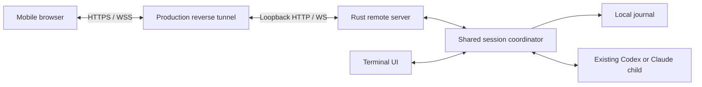

# `/remote-control`: mobile access to a live Rust session

Planning date: 2026-10-04. Status: proposal; no implementation or deployment.
User requirement: connect over the internet from anywhere.

## Recommendation and effort

Build a mobile browser client attached to the existing Rust session, with a
shared session coordinator and an opt-in HTTP/WebSocket server. Keep provider
execution, workspace access, journals and vendor login on the desktop host.
Use a configured production reverse tunnel for the first release; keep the
transport boundary replaceable for a later LocalCode-managed relay.

Estimated effort for one engineer familiar with this repository:

| Delivery | Engineering days | Result |
| --- | ---: | --- |
| Technical prototype | 3–5 | Attach a phone to a demo session; stream, prompt and cancel through a development tunnel. Not a release. |
| Reliable tunnel-based MVP, including prototype work | 20–28 | Pairing, shared control, replay, mobile UI, packaging and failure/security verification. Approximately 4–6 working weeks. |
| LocalCode-managed relay, additional to MVP | 15–25 | Account/device identity, outbound host connection, routing, reconnect, deployment, monitoring and service abuse controls. |
| Managed product, combined | 35–53 | Approximately 7–11 working weeks, with infrastructure available. |

These are planning estimates, not measured implementation times. They assume
one host process, one exposed live session and one paired phone, a browser UI,
and macOS/Linux support. They exclude native mobile apps, fleet migration,
general Rust feature parity and independent security assessment. Tunnel/service
fees and hosting expenses are separate; provider inference continues using the
host's existing account. Re-estimate after the prototype proves session fan-out,
mobile pairing and real tunnel reconnect behavior.

## What the repository already provides

| Existing code | Reuse and gap |
| --- | --- |
| [`lc-core::Session`](../../crates/lc-core/src/lib.rs) | Owns vendor execution and writes events before delivering them. Currently exposes one `mpsc::Receiver<Event>`; it is not a multi-client session service. A stalled consumer can stop execution. |
| [`lc-engine::live`](../../crates/lc-engine/src/live.rs) | Provider-neutral text/tool/approval events; prompt and approval commands; cancellation through a separate watch channel. `Handle::send` acknowledges queueing, not the eventual command result. |
| [`lc-store::Journal`](../../crates/lc-store/src/lib.rs) | Append-only JSONL with sequence numbers and bounded size. Sequence numbers are not exposed with live events, and no replay/snapshot reader exists here. |
| [`lc-tui`](../../crates/lc-tui/src/lib.rs) | Slash commands, local approval UI and session/model changes. Goal continuation and goal persistence are driven from the TUI event loop. This logic needs a shared owner for consistent remote control. |
| Python `SessionRunner`, core RPC route and React UI (removed 2026-10-04; at `54f4ecec4f42`) | Historical reference only: connection-independent turns, multi-subscriber replay and gap recovery, and a web transcript. None of it is in the tree; a phone client is new work. |

The removed Python socket routes accepted clients without LocalCode user/device
authentication, which is why this plan serves a small authenticated surface from
Rust instead.

## First-release user experience

1. In an existing terminal session, enter `/remote-control`.
2. LocalCode starts its remote server, checks the configured tunnel and displays
   an HTTPS URL, QR code, pairing expiry and connection status.
3. Open the URL on a phone. Redeem a short-lived invitation and confirm the new
   device in the terminal before granting access. Pairing works while a turn runs.
4. The phone receives the current transcript, provider/model, running state,
   pending approvals with their remaining deadlines, and goal status.
5. View streaming output, send prompts when idle, cancel a turn, answer approvals,
   and pause/resume an existing goal. Both screens converge on the same state.
6. `/remote-control status` shows the paired device and tunnel state.
   `/remote-control revoke` invalidates that device; `/remote-control off`
   invalidates remote grants and closes only remote resources.

The phone is a session controller, not a second provider process. Initial scope
does not include file browsing, direct shell RPC, new workspaces, model/provider
switching from mobile, or historical session browsing. Prompts can still cause
the existing agent to use its host tools under the current provider permissions.

The desktop must remain awake, online and running LocalCode. Phone disconnection
does not cancel a turn. Quitting the TUI still ends the session. Surviving terminal
exit or host restart requires a separate daemon/recovery design and estimate.
On `/new` or provider/model reconnection, close the remote grant and require fresh
pairing; this prevents an old phone control from targeting a replacement session.

## Architecture

The HTTP server serves a built mobile bundle and the narrow remote API from one
origin, bound to loopback. The default command starts no listener until requested.
A proposed `lc-remote` crate owns web transport, pairing and tunnel lifecycle;
`lc-core` owns authoritative state, command admission and subscriptions.

Use a production Cloudflare Tunnel as the initial adapter, with a configured
hostname and connector. Cloudflare documents outbound-only connections, allowing
access without a publicly routable host IP or inbound port forwarding.
([Tunnel documentation](https://developers.cloudflare.com/cloudflare-one/networks/connectors/cloudflare-tunnel/))

A Quick Tunnel is acceptable for the prototype only: Cloudflare labels it for
testing/development, gives no uptime guarantee and changes the hostname between
runs. A production tunnel has an account/configuration prerequisite; the first
release must make that setup explicit rather than promise a zero-setup command.
([Quick Tunnel documentation](https://developers.cloudflare.com/tunnel/get-started/quick-tunnels/))

HTTPS/WSS through a terminating proxy protects transport but does not make the
session content opaque to that proxy operator. Treat the tunnel operator as a
trusted service. If confidentiality from the relay operator is a requirement,
design application-level end-to-end encryption and trusted client delivery
before choosing the hosted product architecture; that is outside this estimate.

## Shared state and protocol

- Introduce an opaque LocalCode session-instance ID, independent of the vendor
  session ID. Bind credentials, command IDs and approval IDs to that instance.
- Move goal scheduling, running/ready state, pending approvals and prompt
  admission behind one coordinator. Both TUI and remote use the same command
  path. Keep editor drafts, wrapping and terminal presentation in the TUI.
- Persist each provider event before updating shared state and publishing a
  versioned envelope containing `session_id`, monotonic `seq`, type and data.
  Preserve current journal failure behavior; phone transport failures must not
  stop the local provider.
- Provide an atomic snapshot with a sequence watermark plus events after that
  watermark. Register the subscriber while capturing the snapshot boundary so
  attaching mid-stream loses neither tokens nor pending approvals.
- Keep a bounded replay ring and bounded per-client queues. Disconnect a lagging
  remote subscriber and require replay/resynchronization rather than blocking
  engine delivery. If its cursor is too old, send a fresh snapshot. Page older
  transcript records from the journal at a captured complete-record boundary.
- Version 1 remote commands: `prompt`, `cancel`, `answer_approval`, `pause_goal`,
  `resume_goal`; plus snapshot/history reads. Reject arbitrary shell, filesystem,
  configuration, workspace and provider-control requests.
- Every mutation carries a unique request ID. Cache its result for a bounded
  period per authenticated device/session. Retries return the same result;
  reconnect does not blindly resubmit an ambiguous prompt. Define separate
  accepted/rejected results and the subsequent turn lifecycle.
- Serialize desktop and phone prompts: first admitted prompt wins, the next gets
  a visible busy result. No implicit queue in MVP. Resolve competing approval
  replies atomically: one wins, all clients see closure, later replies get a stale
  result. Surface authoritative outcomes rather than optimistic success alone.
- Retain the existing 120-second approval expiry; reconnect never restarts it.
  Extend approval events/snapshots with deadline metadata. Timeout, cancellation
  and unsupported requests remain deny-by-default. Remote cancel also pauses an
  active goal, matching terminal cancellation semantics.

## Pairing and access boundary

Use a cryptographically random, single-use invitation with a short expiry
(proposed: two minutes). Place the invitation secret in the QR URL fragment,
redeem it through a POST, then clear it from the browser address. Do not use a
short numeric code as the sole credential. Require terminal confirmation before
issuing the device grant; never include secrets in transcript or telemetry logs.

Issue a bounded device session using a Secure, HttpOnly, SameSite cookie scoped
to this host/origin and session instance. Check authentication, exact allowed
Origin/Host and grant expiry before WebSocket upgrade; authorize every command
and close existing sockets on expiry, revocation or remote shutdown. Apply CSRF
protection to cookie-authenticated mutation endpoints. A terminal confirmation
handler must continue processing provider events and cannot stall the engine.

Limit pairing attempts, connections, frame sizes and command rates. Preserve the
64 KiB prompt bound and complete approval display; render provider content as
text rather than executable HTML. Use a restrictive CSP, no third-party scripts,
and no-store responses for sensitive data. A service worker/offline transcript
cache is deferred. These controls follow the authentication, origin validation,
message authorization and resource-limit guidance in
[OWASP's WebSocket security guidance](https://cheatsheetseries.owasp.org/cheatsheets/WebSocket_Security_Cheat_Sheet.html).

Manage tunnel children separately from vendor children. Tunnel startup failure,
exit or remote disable leaves the local session running. Only stop connectors
created by this invocation; never stop an unrelated user-managed tunnel. Use
the existing process supervision primitives where appropriate.

## Implementation milestones

| Step | Work and acceptance condition | Days |
| --- | --- | ---: |
| 1. Protocol spike | Specify envelope/command results; prove two consumers on demo plus a real phone through a development tunnel. | 1–2 |
| 2. Shared coordinator | Extract state and goal scheduler; sequence events; snapshot/replay/history; one command/approval admission path. Existing terminal behavior remains covered. | 5–7 |
| 3. Remote server | New transport crate; HTTP/WS routes; pairing, scoped grants, revocation, limits and lifecycle handling. | 3–4 |
| 4. Mobile client | Adapt React rendering; phone composer, complete approval details, cancel, goal controls, reconnect and request-result handling. | 4–5 |
| 5. Internet integration | Production tunnel configuration, `/remote-control` commands, QR/status UI, asset embedding and installation documentation. | 2–3 |
| 6. Release verification | Failure/race/security tests, real iOS/Android checks, macOS/Linux packaging and local lifecycle regressions. | 5–7 |
| **Total** | **Tunnel-based MVP** | **20–28** |

Steps 1–2 are prerequisites for useful remote control. Server and mobile work can
proceed concurrently after the protocol is fixed, but the estimate assumes one
engineer. A 3–5 day prototype only exercises a subset of steps 1–4 and must not
be shipped as though it contains all pairing, replay and lifecycle guarantees.

Ship a focused mobile entry point rather than expose the entire legacy frontend.
Embed its compiled assets in release binaries, following this repository's Rust
build/install workflow; Node is a build dependency, not a runtime prerequisite.
Verify clean builds and asset reproducibility on the supported release targets.

## Release checks

1. Attach mid-response and mid-approval: transcript matches the terminal, with no
   missing/duplicated output and the original approval deadline.
2. Lock/background a real phone, switch Wi-Fi to cellular, restart the tunnel,
   and reconnect after the replay window expires: recover through replay or an
   explicit snapshot, without restarting the provider. Cloudflare documents that
   network deployments can terminate WebSockets, making this essential.
   ([WebSocket documentation](https://developers.cloudflare.com/network/websockets/))
3. Send the same prompt twice after losing its acknowledgement: exactly one
   provider turn. Competing desktop/phone prompts and approval answers produce
   deterministic visible results.
4. A slow or flooding phone cannot block the terminal, exhaust unbounded memory
   or stop the local turn. Disk failure continues to stop safely as it does now.
5. Invalid/expired/reused invitations, missing grants, cross-origin sockets,
   cross-session IDs and stale approvals are rejected. Revoke/off closes active
   remote sockets and prevents reconnect.
6. Goal pause/resume/cancel works from both clients without duplicate continuation.
   Existing model/new/reconnect behavior invalidates the old remote grant.
7. Phone viewport and keyboard do not hide send/cancel/approval actions; long
   command and patch details remain readable on iOS Safari and Android Chrome.
8. Existing Rust tests and terminal lifecycle checks pass, including Ctrl+Q,
   SIGTERM, suspend/resume and child cleanup. Tunnel failure/off leaves vendor
   execution intact; TUI quit tears down owned remote resources.

## Later managed experience

Replace the user-configured tunnel with an outbound authenticated host channel
to a LocalCode relay. The hosted service supplies stable rendezvous, device/host
identity, routing and service limits; the host remains authoritative for session
commands and approvals. Keep session text off relay persistence and logs.

Budget the additional 15–25 days for account/device enrollment (3–5), relay and
host routing/reconnect (5–8), deployment/monitoring/abuse handling (4–6), and
integration failure verification (3–6). Operating ownership, data handling and
service availability must be specified before release. End-to-end encryption,
push notifications, native apps, multiple simultaneous sessions and daemonized
host execution are separate follow-on projects.

Recommended first implementation task: introduce a shared session coordinator
and a versioned snapshot/event protocol, proving two subscribers without changing
provider launch or terminal behavior. That establishes the foundation for either
internet transport and addresses the largest repository-specific dependency.
