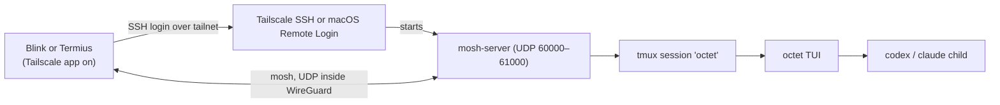

# Phone access over tmux, Tailscale SSH and mosh

Evaluation date: 2026-10-05. Status: the `/remote-control` helper and the
three phone fixes below are implemented; testing on real phones is still
pending. Step-by-step setup: [Use Octet from your phone](../remote-control.md).
Companion to the [web-client plan](remote-control-plan.md).

## Question and answer

Can a phone terminal (Blink Shell or Termius) reach a live Octet session
through tmux, Tailscale SSH and mosh, with no Octet code?

**Yes, for a single person on their own devices, and it can be documented
today.**
- SSH handles login, and the Tailscale tunnel handles encryption.
- mosh keeps the session through switches between Wi-Fi and cellular.
- tmux keeps Octet running while the phone is away.

**Before the fixes below, two things made it a personal setup rather than a
product:**
- **Approvals timed out unseen.** Nothing alerted the phone, and a request
  waiting while you were away was denied after 120 seconds. Now a terminal
  bell reaches the phone, and `--approval-timeout` lengthens the window.
- **The prompt box crowded out the conversation on a phone.** With the
  on-screen keyboard open, the conversation shrank to a single row. Now an
  empty prompt box takes 4 rows instead of 7.

The `/remote-control` helper and those three changes are implemented. The 20–28-day web
client remains the route to a guided, multi-device product.

| Option | Effort | What you get | What you give up |
| --- | ---: | --- | --- |
| tmux + Tailscale SSH + mosh, docs only | 0 days | The full TUI on the phone. SSH handles login and encryption; mosh survives network switches. | Untested on real phones. No alerts, so approvals time out. Shell access includes the power to switch to `full-access`. |
| The same plus a `/remote-control` setup helper | 1–2 days | One command that checks the setup and prints the exact phone command. | Still no alerts; still the TUI at phone size. |
| The same plus the phone fixes below | 3–5 more days | A prompt box that shrinks, an approval alert, and an approval window that suits a phone. | Still a terminal UI on a phone. |
| Web client ([plan](remote-control-plan.md)) | 20–28 days | Pairing, a phone-native UI and shared control. | A large new surface to build and secure. |

## How the pieces fit



- **Tailscale** puts the phone and the host on one private network (a
  "tailnet") over WireGuard. There are no open ports and no port forwarding,
  and the UDP that mosh needs passes through the tunnel unchanged.
- **SSH** authenticates once per connection, then mosh takes over the session.
  [Blink](https://docs.blink.sh/advanced/advanced-mosh) and
  [Termius](https://termius.com/free-ssh-client-for-ipad) both bootstrap mosh
  this way. Termius ships its own compatible mosh client in its free tier.
- **mosh** keeps the screen in sync over UDP and resumes after the phone
  sleeps or changes network. It mirrors only the visible screen, so scrollback
  comes from Octet's own PgUp/PgDn (or tmux copy mode).
  [mosh 1.4.0](https://mosh.org/) added 24-bit colour, which Octet needs.
- **tmux** owns the terminal Octet runs in. Detaching the phone, or losing it,
  leaves the agent running; the next connection reattaches to the same
  screen.

## Host setup on macOS (docs only)

Pick one way to log in.

### Option A: Tailscale SSH

The [Tailscale SSH server](https://tailscale.com/kb/1193/tailscale-ssh) runs
only on Linux and on the **open-source** `tailscale` + `tailscaled` build for
macOS. The App Store app cannot accept Tailscale SSH connections.

1. Install the open-source build: `brew install tailscale`, then start its
   daemon (`sudo tailscaled install-system-daemon`) and run `tailscale up`.
2. Enable the SSH server: `tailscale set --ssh`.
3. In the tailnet policy file, allow only your own devices to reach this host
   as your user. Use `"action": "check"` so each new session needs a recent
   sign-in with your identity provider (every 12 hours by default).

### Option B: macOS Remote Login over the tailnet

This works with the App Store Tailscale app.

1. Turn on **System Settings → General → Sharing → Remote Login** and limit it
   to your user.
2. Add the phone's SSH public key to `~/.ssh/authorized_keys`, and turn off
   password login.
3. Connect using the host's tailnet name or `100.x` address, so SSH is never
   reachable from the open internet.

### Both options

1. Install mosh 1.4.0 or newer and tmux: `brew install mosh tmux`.
2. Give tmux 24-bit colour by adding these lines to `~/.tmux.conf`:

   ```
   set -g default-terminal "tmux-256color"
   set -as terminal-features ",xterm-256color:RGB"
   ```

   Without the second line, tmux reduces Octet's palette to 256 colours.
3. Keep the host awake while away: set Energy settings to prevent sleep, or
   run `caffeinate -dims` inside tmux.
4. Start Octet inside a named tmux session:

   ```sh
   tmux new -A -s octet "octet --engine codex --cwd ~/Projects/my-app"
   ```

   `-A` attaches if the session already exists. Start it at your desk; the
   phone only reattaches.
5. So a bell from a window you aren't looking at gets flagged, add to
   `~/.tmux.conf`:

   ```
   set -g monitor-bell on
   set -g bell-action any
   ```

6. Run `/remote-control` in Octet to check all of the above.

## Phone setup

1. Install the Tailscale app on the phone and sign in to the same tailnet.
2. In **Blink**, add a host with the Mac's tailnet name and your user, then
   connect with:

   ```
   mosh my-mac -- tmux new -A -s octet
   ```

3. In **Termius**, create the host and turn on **Mosh**. Add a startup snippet
   that runs `tmux new -A -s octet`. If your Termius version doesn't run
   snippets over mosh, type that line after connecting.
4. Pin Ctrl and Esc in the app's extra key bar. On a phone keyboard:

   | Octet key | On the phone |
   | --- | --- |
   | Esc (cancel) | Key bar Esc |
   | Ctrl+C twice (quit) | Key bar Ctrl, then C, twice |
   | Alt+Enter (newline) | **Ctrl+J** instead; phone keyboards rarely send Alt+Enter |
   | Shift+Tab (cycle mode) | `/mode auto` etc., if the app has no Shift+Tab |
   | F1 (help) | `/help` |
   | PgUp/PgDn (scroll) | Key bar PgUp/PgDn, or tmux copy mode |

   Quitting Octet from the phone ends the agent's session. To leave it
   running, close the app or detach tmux with Ctrl+B then D.

## What the evaluation found

### Phone-sized screens (rendered, not yet on a device)

I rendered Octet's real screen at the sizes a phone terminal is likely to
report. The exact size depends on the app, font and device, so measure it
with `stty size` on each phone.

| Phone layout (approx. columns × rows) | Result |
| --- | --- |
| Portrait, keyboard hidden (≈ 44 × 30) | Usable. Banner, mode, status and about 15 rows of conversation. The header cuts the model and folder names. |
| Portrait, keyboard shown (≈ 44 × 16) | Tight. Before the prompt box change, the fixed 7-row box left **one row** of conversation; now an empty box takes 4 rows and **four** remain. |
| Approval at ≈ 44 × 16 | The request fits and can be scrolled; **A** and **D** are visible. The key line and title are cut off at the right. |
| Landscape, keyboard shown (≈ 90 × 10) | **Blocked.** Below Octet's 38 × 12 minimum, so only "Enlarge the terminal" shows. Rotate to portrait to type. |

### Claims checked

| Claim | Holds? | Notes |
| --- | --- | --- |
| SSH handles login and encryption | Yes | Tailscale's WireGuard encrypts. Tailscale SSH or OpenSSH authenticates. |
| mosh survives Wi-Fi ↔ cellular | Yes | Over UDP inside the tailnet; no extra firewall or ports. |
| Full TUI at phone width | Partly | Works in portrait; landscape with keyboard is below the minimum. See above. |
| No alerts, so approvals time out | Yes, before the fixes | The approval window ran while the phone was away and unanswered requests were denied. A bell now reaches the phone, and `--approval-timeout` sets the window (10–3600 s, default 120). |
| Keystroke access includes full-access | Yes | An SSH user can type `/mode full-access` and also has a shell. Limit who can reach the host (see Risks). |

## Risks and mitigations

- **Approvals are denied while you're away.** Expect denied actions on
  long-running work. Prefer `ask` mode and check in, or use `auto` so the
  vendor's own reviewer decides. Phone fixes 2 and 3 below help: a bell
  when an approval opens, and a longer window with `--approval-timeout`.
- **Full shell access.** Whoever can SSH in can run anything as your user.
  Grant SSH only to your own devices in the tailnet policy, use Tailscale
  check mode or key-only Remote Login, and never expose SSH outside the
  tailnet.
- **Two screens, one session.** The desk and the phone attached to the same
  tmux session type into the same prompt. tmux sizes the screen to the
  smaller client, so the desk view shrinks to phone size while the phone is
  attached.
- **The host must stay on.** Sleep, a reboot or quitting Octet ends the
  session.
- **Leftover mosh servers.** A phone that vanishes without disconnecting can
  leave `mosh-server` processes on the host until they time out. Clear them
  with `pkill mosh-server` if needed.

## What `/remote-control` does

A read-only command that sets nothing up by itself, and never edits system or
tailnet configuration. It checks what is there and prints the next step:

1. **Session:** is Octet running inside tmux (`$TMUX`), and under which
   session name? If not, show the `tmux new -A -s octet …` line to restart in.
2. **Tailnet:** is the `tailscale` CLI present and connected? Read this
   host's tailnet name and address from `tailscale status --json`.
3. **Login:** is Tailscale SSH on (asked from `tailscale debug prefs`), or
   does SSH answer on the tailnet address (Remote Login)? Tailscale SSH serves
   only connections arriving through the tunnel, so the Mac can't test it by
   connecting to itself. If neither, it names the ways to turn SSH on:
   Remote Login, or `tailscale set --ssh` unless only the App Store app is
   installed, which can't run Tailscale SSH.
4. **mosh:** is `mosh-server` installed and at least version 1.4.0?
5. **Colour:** do tmux's server options give terminals 24-bit colour (an `RGB`
   terminal feature, or a `Tc` override on older tmux)? If not, show the
   `.tmux.conf` lines; if tmux reports neither option, say nothing.
6. **Phone command:** print the exact Blink and Termius commands for this
   host, user and tmux session, ready to copy.

All the commands share one 2-second deadline, and the SSH check then gets
half a second, so the screen waits about 2.5 seconds at most. The results
appear as a note in the conversation. It starts no listener and holds no
secrets. The App Store Tailscale app is found inside its app bundle when
`tailscale` isn't on the PATH.

`/remote-control status` shows the same checks. Every report line, its fix,
what the check can't see and phone-side troubleshooting are in
[the setup guide](../remote-control.md#the-remote-control-check). Pairing,
QR codes and grants belong to the [web plan](remote-control-plan.md), not
here.

## Phone fixes

1. **Prompt box that grows with the draft.** 4 rows when empty, up to 7. With
   the keyboard shown this returns 3 rows to the conversation, the biggest
   single phone improvement.
2. **Approval alert.** A terminal bell and an OSC 9 desktop notification when
   an approval opens. Through the documented chain (phone app, mosh, tmux)
   only the **bell** arrives: tmux drops OSC 9 and mosh doesn't forward it.
   The notification helps only a desktop terminal connected directly. Whether
   Blink or Termius show a bell while backgrounded needs testing on a device;
   if they don't, a push service is the fallback, and that is part of the web
   plan.
3. **A longer approval window.** `octet --approval-timeout 600` gives a phone
   user ten minutes to notice. It accepts 10–3600 seconds; the default stays
   120, and timeouts still deny. Set it when starting Octet in tmux.

## Verify on real devices before recommending it widely

1. Measure `stty size` in Blink and Termius on a small and a large phone, in
   portrait and landscape, with the keyboard shown and hidden.
2. Confirm 24-bit colour through Blink → mosh 1.4 → tmux → Octet (the mascot
   and the mode chip show their exact colours).
3. Switch Wi-Fi to cellular mid-reply and lock the phone for five minutes: the
   reply keeps streaming on the host, and the screen catches up on return.
4. Answer an approval, cancel a turn with Esc, quit with Ctrl+C twice, and
   insert a newline with Ctrl+J from each app.
5. Attach from the desk and the phone at once; confirm both see the same
   session and that the desk returns to full size after the phone detaches.
